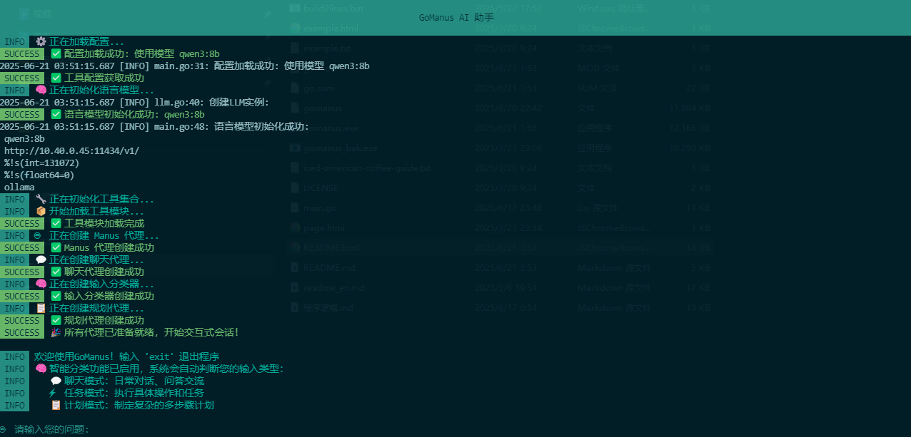

# GoManus 项目
<p align="center">
  
</p>
## 项目简介

### GoManus：AI代理系统的革命，让自动化变得如此简单！
想象一下，一个AI代理系统，它不仅能够理解你的每一个命令，还能像一个真正的助手一样，帮你完成各种复杂任务。这不是科幻小说中的情节，而是GoManus——一个基于Go语言的AI代理系统，它正将这一切变为现实！
### 什么是GoManus？
GoManus，这个听起来就充满力量的名字，实际上是一个全开源的AI代理系统。它不仅能够帮助用户与AI进行交互，还能实现自动化和智能化的任务处理。这意味着，无论是数据分析、文件管理，还是网络搜索，GoManus都能帮你一手包办。
### 为什么选择GoManus？
选择GoManus的理由简直多到数不清！首先，它完全开源，这意味着你可以在这个项目的基础上进行二次开发，打造一个完全属于你自己的AI助手。其次，GoManus不需要复杂的环境部署。忘掉那些让人头疼的conda和python环境包吧，GoManus只需要你下载一个GoManus.exe文件，然后CMD，它就能在你的电脑上运行起来！
### 如何使用GoManus？
使用GoManus，简直比吃蛋糕还要简单。你只需要下载GoManus.exe文件，然后运行它。接下来，配置好  config/config.toml  文件，你的AI助手就准备好了。是的，就是这么简单！GoManus的强大功能GoManus的功能强大到令人难以置信。它支持市面上主流的LLM模型，能够与AI进行交互，实现自动化和智能化的任务处理。此外，它还能与各种工具进行交互，包括百度百科、Google、知乎、维基百科等搜索工具。文件保存、浏览器使用、任务终止、多工具调用与规划、记忆管理，这些功能GoManus一应俱全。

## 项目地址

- 项目地址(中国)：https://gitee.com/therebody/go-manus

- 项目地址：https://github.com/ardyli/GoManus

## 功能

- 与 LLM 进行交互，支持市面上主流的 LLM 模型
- 与 AI 进行交互，实现自动化和智能化的任务处理
- 与工具进行交互（支持百度百科、Google、知乎、维基百科等搜索工具）
- 文件保存功能
- 浏览器使用功能
- 任务终止功能
- 多工具调用与规划功能
- 记忆管理功能
- 命令终端操作，可以能通过shell命令操作windows\linux\mac

## 介绍
** 启动界面：**
<p align="center">
  
</p>


## 技术栈

- Go 1.24
- Viper v1.18.2
- GORM v1.25.7
- SQLite v1.14.17
- Sonic v1.9.1
- PTerm   https://pterm.sh/
## 项目结构

- `config/`: 配置文件目录
  - `config.toml`: 配置文件
- `internal/`: 核心实现
  - `agent/`: AI 代理实现
    - `base.go`: 基础功能
    - `manus.go`: 主逻辑
    - `planning.go`: 规划功能
    - `react.go`: 反应功能
    - `toolcall.go`: 工具调用
  - `config/`: 配置管理
    - `config.go`: 配置加载
  - `llm/`: LLM 交互
    - `llm.go`: LLM 接口
  - `middleware/`: 中间件
    - `refresh.go`: 自动刷新
  - `schema/`: 数据结构
    - `agent.go`: 代理相关
    - `message.go`: 消息结构
    - `toolcall.go`: 工具调用结构
  - `tool/`: 工具实现
    - `baidu_baike_search.go`: 百度百科搜索
    - `base.go`: 工具基础
    - `browser_use.go`: 浏览器使用
    - `collection.go`: 工具集合
    - `file_saver.go`: 文件保存
    - `google_search.go`: Google 搜索
    - `planning.go`: 工具规划
    - `terminate.go`: 任务终止
    - `wikipedia_search.go`: 维基百科搜索
    - `zhihu_search.go`: 知乎搜索
- `main.go`: 项目入口文件
- `go.mod` 和 `go.sum`: Go 模块依赖管理文件
  
## 模型选用说明
 ** 建议使用qwen3,本人使用过功能比较完整。deepseek r1 对工具支持有些问题，请暂绕行！ **


## 使用说明
 下载版：
  下载windows版本：
   命令窗口执行：
   进入目录:
   cd GoManus
   命令窗口执行：
   ./GoManus.exe
  下载linux版本：
  chmod +x GoManus
  命令窗口执行:
  ./GoManus
### 源码版：
1. 确保已安装 Go 1.21 或更高版本
2. 克隆项目到本地：
   ```bash
   git clone https://gitee.com/therebody/GoManus.git
   ```
3. 进入项目目录并安装依赖：
   ```bash
   go mod tidy
   ```
4. 运行项目：
   ```bash
   go run main.go
   ```


## 配置说明

1. 修改 `config/config.toml` 文件配置系统参数
2. 配置 LLM API 密钥
3. 配置工具相关参数

## 贡献指南

欢迎提交 PR 或 Issue 来改进项目。主要贡献方向包括：

- 新工具集成
- UI 功能改进
- 性能优化
- 文档完善
- 测试用例编写

贡献流程：

1. Fork 本仓库
2. 新建功能分支（Feat_xxx）或修复分支（Fix_xxx）
3. 提交代码变更
4. 新建 Pull Request
5. 等待代码审查与合并

## 许可证

本项目采用 BSD3 许可证，详情请查看 LICENSE 文件。
