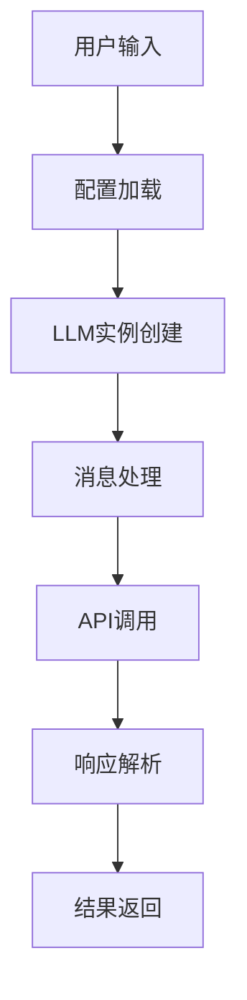
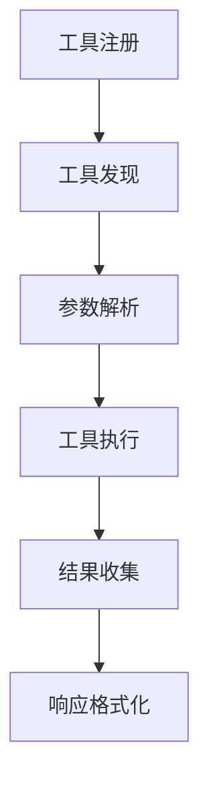
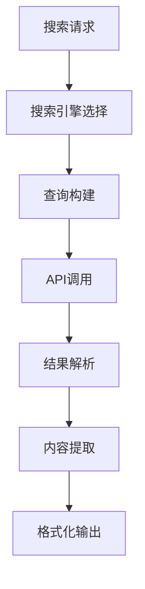
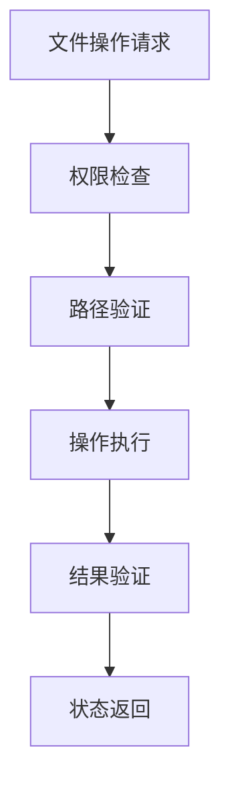
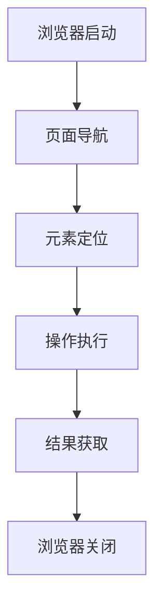
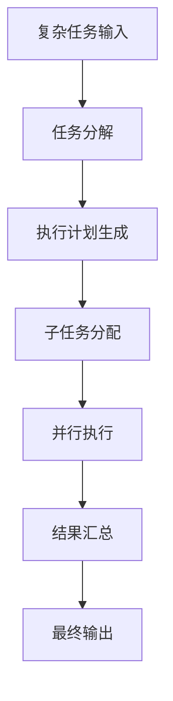
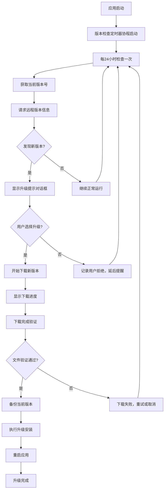
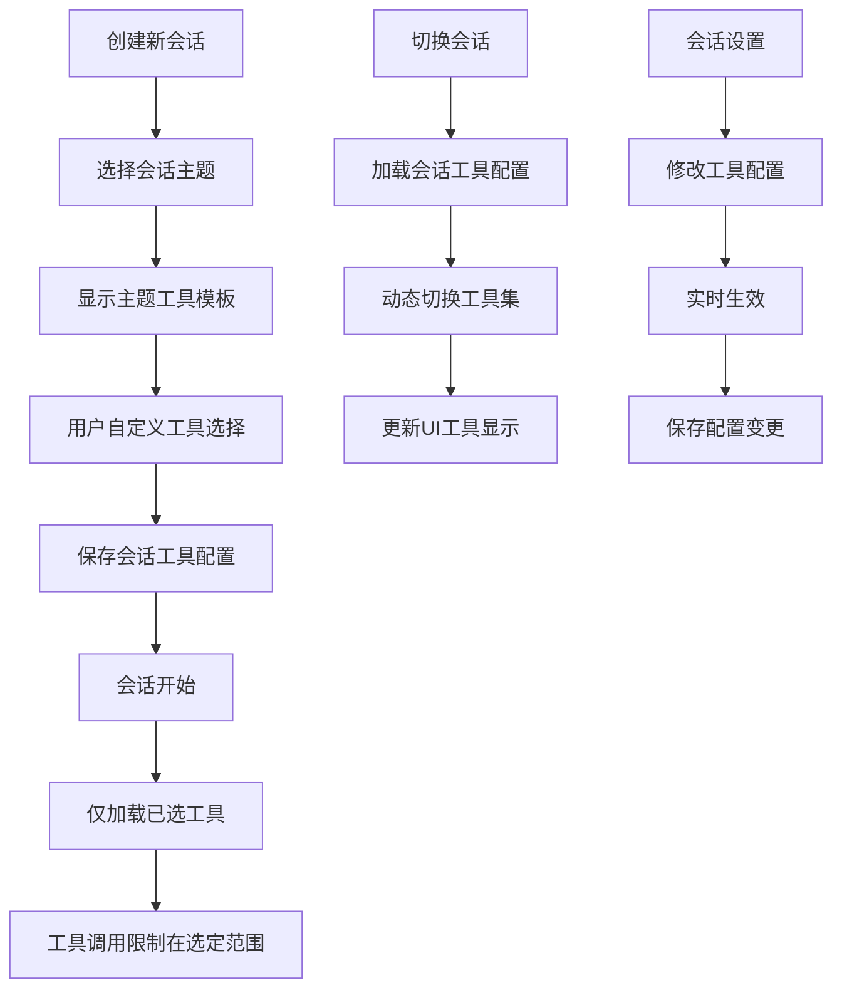

# GoManus AI代理系统需求规格说明书

## 1. 项目背景

### 1.1 项目起源
GoManus是一个基于Go语言开发的AI Agent系统，旨在为用户提供智能化、自动化的任务处理能力。该项目致力于简化AI交互流程，让用户能够通过自然语言与AI进行高效沟通，并实现复杂任务的自动化执行。

### 1.2 业务需求
- **智能交互需求**：用户需要一个能够理解自然语言指令的AI助手
- **自动化处理需求**：系统需要能够自动执行各种复杂任务，如数据分析、文件管理、网络搜索等
- **工具集成需求**：需要集成多种外部工具和服务，提供丰富的功能支持
- **易用性需求**：系统部署和使用应当简单便捷，无需复杂的环境配置

### 1.3 目标用户
- **开发者**：需要AI辅助开发和自动化工具的软件开发人员
- **研究人员**：需要AI助手进行数据分析和信息检索的科研工作者
- **企业用户**：需要智能化办公助手的商业用户
- **个人用户**：对AI技术感兴趣的普通用户

### 1.4 市场定位
定位为轻量级、易部署的开源AI代理系统，填补市场上缺乏简单易用的本地化AI助手的空白。

## 2. 总体描述

### 2.1 系统概述
GoManus是一个模块化的AI Agent系统，采用插件式架构设计，支持多种LLM模型，具备丰富的工具集成能力。系统通过现代化的桌面GUI界面提供交互式服务，支持普通模式和规划模式两种工作方式。

### 2.2 系统边界
- **技术边界**：基于Go语言生态，支持主流LLM API
- **功能边界**：专注于AI代理和工具调用，不涉及模型训练
- **部署边界**：支持本地部署，可扩展至云端部署

### 2.3 系统限制
- 依赖外部LLM API服务
- 部分工具功能需要网络连接
- 提供现代化的桌面GUI交互界面

### 2.4 系统功能布局
- **主窗体**
左边为聊天会话列表，中间为聊天会话，右边为工具列表，下边为聊天会话详情。
右上角有设置按钮，点击进入设置页面。

## 3. 具体需求

### 3.1 功能性需求

#### 功能编号：F-001
**功能描述：LLM交互管理**
- **功能操作流程**：

- **具体功能规格描述**：
  - 支持多种主流LLM模型（OpenAI、Claude等）
  - 可配置API密钥、基础URL、最大令牌数、温度参数
  - 支持流式和非流式响应
  - 具备错误处理和重试机制
- **输入**：用户自然语言指令、LLM配置参数
- **输出**：LLM生成的响应内容
- **前置条件**：有效的LLM API配置
- **后置条件**：返回格式化的响应结果
- **优先级**：高

#### 功能编号：F-002
**功能描述：工具调用系统**
- **功能操作流程**：

- **具体功能规格描述**：
  - 支持动态工具注册和管理
  - 提供统一的工具调用接口
  - 支持工具链式调用
  - 具备工具执行状态监控
- **输入**：工具名称、调用参数
- **输出**：工具执行结果
- **前置条件**：工具已正确注册
- **后置条件**：返回工具执行状态和结果
- **优先级**：高

#### 功能编号：F-003
**功能描述：搜索工具集成**
- **功能操作流程**：

- **具体功能规格描述**：
  - 支持Google搜索、百度百科、知乎、维基百科等多种搜索源
  - 提供统一的搜索接口
  - 支持搜索结果过滤和排序
  - 具备搜索历史记录功能
- **输入**：搜索关键词、搜索引擎类型
- **输出**：格式化的搜索结果
- **前置条件**：网络连接正常，相关API配置有效
- **后置条件**：返回相关搜索结果列表
- **优先级**：中

#### 功能编号：F-004
**功能描述：文件操作管理**
- **功能操作流程**：

- **具体功能规格描述**：
  - 支持文件读取、写入、删除、移动等基本操作
  - 提供文件内容搜索和替换功能
  - 支持多种文件格式处理
  - 具备文件操作安全检查
- **输入**：文件路径、操作类型、操作参数
- **输出**：操作结果状态
- **前置条件**：具备相应文件系统权限
- **后置条件**：文件操作完成，返回操作状态
- **优先级**：中

#### 功能编号：F-005
**功能描述：浏览器自动化**
- **功能操作流程**：

- **具体功能规格描述**：
  - 支持网页自动化操作
  - 提供页面元素定位和交互功能
  - 支持页面内容提取和截图
  - 具备浏览器会话管理
- **输入**：目标URL、操作指令
- **输出**：页面内容或操作结果
- **前置条件**：浏览器驱动正确安装
- **后置条件**：完成指定的浏览器操作
- **优先级**：低

#### 功能编号：F-006
**功能描述：任务规划系统**
- **功能操作流程**：

- **具体功能规格描述**：
  - 支持复杂任务的自动分解
  - 提供智能执行计划生成
  - 支持多代理协作执行
  - 具备任务执行监控和调度
- **输入**：复杂任务描述
- **输出**：任务执行计划和结果
- **前置条件**：规划代理已启用
- **后置条件**：复杂任务被分解并执行完成
- **优先级**：中

#### 功能编号：F-007
**功能描述：配置管理系统**
- **功能操作流程**：
```svg
<svg width="600" height="400" xmlns="http://www.w3.org/2000/svg">
  <!-- 配置文件加载 -->
  <rect x="50" y="50" width="120" height="60" rx="10" fill="#e1f5fe" stroke="#0277bd" stroke-width="2"/>
  <text x="110" y="85" text-anchor="middle" font-size="12" fill="#0277bd">配置文件加载</text>
  
  <!-- 参数验证 -->
  <rect x="220" y="50" width="120" height="60" rx="10" fill="#f3e5f5" stroke="#7b1fa2" stroke-width="2"/>
  <text x="280" y="85" text-anchor="middle" font-size="12" fill="#7b1fa2">参数验证</text>
  
  <!-- 默认值设置 -->
  <rect x="390" y="50" width="120" height="60" rx="10" fill="#e8f5e8" stroke="#388e3c" stroke-width="2"/>
  <text x="450" y="85" text-anchor="middle" font-size="12" fill="#388e3c">默认值设置</text>
  
  <!-- 配置应用 -->
  <rect x="220" y="170" width="120" height="60" rx="10" fill="#fff3e0" stroke="#f57c00" stroke-width="2"/>
  <text x="280" y="205" text-anchor="middle" font-size="12" fill="#f57c00">配置应用</text>
  
  <!-- 运行时更新 -->
  <rect x="220" y="290" width="120" height="60" rx="10" fill="#fce4ec" stroke="#c2185b" stroke-width="2"/>
  <text x="280" y="325" text-anchor="middle" font-size="12" fill="#c2185b">运行时更新</text>
  
  <!-- 箭头 -->
  <path d="M170 80 L220 80" stroke="#666" stroke-width="2" marker-end="url(#arrowhead)"/>
  <path d="M340 80 L390 80" stroke="#666" stroke-width="2" marker-end="url(#arrowhead)"/>
  <path d="M450 110 L450 140 L280 140 L280 170" stroke="#666" stroke-width="2" marker-end="url(#arrowhead)"/>
  <path d="M280 230 L280 290" stroke="#666" stroke-width="2" marker-end="url(#arrowhead)"/>
  
  <!-- 箭头标记 -->
  <defs>
    <marker id="arrowhead" markerWidth="10" markerHeight="7" refX="9" refY="3.5" orient="auto">
      <polygon points="0 0, 10 3.5, 0 7" fill="#666"/>
    </marker>
  </defs>
</svg>
```
- **具体功能规格描述**：
  - **TOML配置文件支持**：
    - 支持标准TOML格式配置文件解析
    - 配置文件路径：`config/config.toml`
    - 支持嵌套配置结构和数组配置
  - **LLM模型配置管理**：
    - 全局LLM配置：模型名称、API地址、密钥、最大令牌数、温度参数
    - 特定模型类型配置：视觉模型、语音模型等专用配置
    - 支持多个LLM提供商的配置切换
  - **工具配置管理**：
    - 各工具模块的启用/禁用开关
    - 工具特定参数配置（搜索API密钥、浏览器路径等）
    - 工具优先级和调用策略配置
  - **语音模型API配置**：
    - TTS（文本转语音）模型配置
    - STT（语音转文本）模型配置
    - 语音质量、采样率、语言设置
  - **向量处理模型配置**：
    - 文本嵌入模型配置（模型名称、API地址）
    - 向量维度、相似度阈值设置
    - 向量数据库连接配置
    - 重排序模型配置（模型名称、API地址、重排序阈值）
    - 重排序策略设置（启用条件、候选数量限制）
    - 混合检索权重配置（向量检索权重、重排序权重）
  - **工作目录配置**：
    - 全局工作目录路径设置
    - 会话子目录命名规则配置
    - 自动清理策略配置（保留天数、大小限制）
  - **系统配置管理**：
    - 日志级别和输出路径配置
    - 界面主题和语言设置
    - 性能参数调优配置
  - **配置验证和默认值**：
    - 配置参数类型和范围验证
    - 缺失配置项的默认值自动填充
    - 配置冲突检测和解决
  - **运行时配置更新**：
    - 支持热重载配置文件
    - 配置变更通知机制
    - 配置备份和恢复功能
- **输入**：
  - 配置文件路径（config/config.toml）
  - 配置参数修改请求
  - 配置重载命令
- **输出**：
  - 解析后的配置对象
  - 配置验证结果
  - 配置应用状态反馈
- **前置条件**：
  - 配置文件存在且格式正确
  - 应用具有配置文件读写权限
  - 相关API服务可访问（如LLM API）
- **后置条件**：
  - 系统配置成功加载并应用
  - 各模块按配置正确初始化
  - 配置变更日志正确记录
- **优先级**：高

#### 功能编号：F-008
**功能描述：桌面UI界面系统**
- **功能操作流程**：
```svg
<svg width="600" height="400" xmlns="http://www.w3.org/2000/svg">
  <defs>
    <marker id="arrowhead" markerWidth="10" markerHeight="7" refX="9" refY="3.5" orient="auto">
      <polygon points="0 0, 10 3.5, 0 7" fill="#333" />
    </marker>
  </defs>
  
  <!-- 流程节点 -->
  <rect x="50" y="50" width="100" height="40" rx="5" fill="#e1f5fe" stroke="#01579b" stroke-width="2"/>
  <text x="100" y="75" text-anchor="middle" font-family="Arial" font-size="12">应用启动</text>
  
  <rect x="200" y="50" width="100" height="40" rx="5" fill="#e8f5e8" stroke="#2e7d32" stroke-width="2"/>
  <text x="250" y="75" text-anchor="middle" font-family="Arial" font-size="12">UI初始化</text>
  
  <rect x="350" y="50" width="100" height="40" rx="5" fill="#fff3e0" stroke="#ef6c00" stroke-width="2"/>
  <text x="400" y="75" text-anchor="middle" font-family="Arial" font-size="12">主窗口显示</text>
  
  <rect x="200" y="130" width="100" height="40" rx="5" fill="#fce4ec" stroke="#c2185b" stroke-width="2"/>
  <text x="250" y="155" text-anchor="middle" font-family="Arial" font-size="12">用户交互</text>
  
  <rect x="50" y="210" width="100" height="40" rx="5" fill="#f3e5f5" stroke="#7b1fa2" stroke-width="2"/>
  <text x="100" y="235" text-anchor="middle" font-family="Arial" font-size="12">设置界面</text>
  
  <rect x="200" y="210" width="100" height="40" rx="5" fill="#e0f2f1" stroke="#00695c" stroke-width="2"/>
  <text x="250" y="235" text-anchor="middle" font-family="Arial" font-size="12">聊天对话</text>
  
  <rect x="350" y="210" width="100" height="40" rx="5" fill="#fff8e1" stroke="#ff8f00" stroke-width="2"/>
  <text x="400" y="235" text-anchor="middle" font-family="Arial" font-size="12">主题切换</text>
  
  <rect x="200" y="290" width="100" height="40" rx="5" fill="#ffebee" stroke="#d32f2f" stroke-width="2"/>
  <text x="250" y="315" text-anchor="middle" font-family="Arial" font-size="12">响应处理</text>
  
  <!-- 连接线 -->
  <line x1="150" y1="70" x2="200" y2="70" stroke="#333" stroke-width="2" marker-end="url(#arrowhead)"/>
  <line x1="300" y1="70" x2="350" y2="70" stroke="#333" stroke-width="2" marker-end="url(#arrowhead)"/>
  <line x1="400" y1="90" x2="250" y2="130" stroke="#333" stroke-width="2" marker-end="url(#arrowhead)"/>
  <line x1="200" y1="155" x2="150" y2="210" stroke="#333" stroke-width="2" marker-end="url(#arrowhead)"/>
  <line x1="250" y1="170" x2="250" y2="210" stroke="#333" stroke-width="2" marker-end="url(#arrowhead)"/>
  <line x1="300" y1="155" x2="350" y2="210" stroke="#333" stroke-width="2" marker-end="url(#arrowhead)"/>
  <line x1="250" y1="250" x2="250" y2="290" stroke="#333" stroke-width="2" marker-end="url(#arrowhead)"/>
  
  <!-- 循环箭头 -->
  <path d="M 300 315 Q 380 340 380 280 Q 380 240 350 230" stroke="#666" stroke-width="2" fill="none" marker-end="url(#arrowhead)"/>
  <text x="390" y="285" font-family="Arial" font-size="10" fill="#666">循环交互</text>
</svg>
```
- **具体功能规格描述**：
  - **主窗口设计**：
    - 采用Cogent Core框架构(官网网址： https://www.cogentcore.org/core/)建原生桌面应用
    - 窗口尺寸：最小800x600像素，支持自由缩放
    - 窗口标题："GoManus AI Assistant"
    - 支持窗口最小化、最大化、关闭操作
    - **毛玻璃效果**：窗体背景实现半透明毛玻璃视觉效果
    - **透明度控制**：背景透明度85%，确保内容可读性
    - **模糊渲染**：背景模糊半径8-12像素，支持实时模糊效果
  - **聊天对话区域**：
    - **消息显示区域**：
      - 左侧为消息历史显示区域，支持滚动浏览
      - 消息气泡样式：用户消息右对齐（蓝色），AI回复左对齐（灰色）
      - 支持消息时间戳显示和消息复制功能
      - **Markdown渲染**：支持富文本显示，包括标题、列表、代码块、表格
      - **SVG图形显示**：内联SVG直接渲染，支持交互和动画
      - **Mermaid图表**：实时渲染流程图、时序图等图表
      - **文件引用显示**：显示文件缩略图和路径信息
    - **输入区域设计**：
      - 多行文本输入框，支持自动换行和滚动
      - **语音输入按钮**：圆形麦克风图标，位于输入框右侧
      - **模式切换按钮**：语音/文字模式切换，带状态指示
      - **文件拖拽区域**：整个输入区域支持文件拖拽，拖拽时高亮显示
      - **发送按钮**：位于输入框右下角，支持快捷键操作
    - **语音录音界面**：
      - 录音状态指示：波形动画或脉冲效果
      - 录音时长显示：实时显示录音时间
      - 取消录音按钮：支持取消当前录音
      - 录音完成提示：显示"松手发送"提示文字
  - **设置按钮功能**：
    - 位置：窗口右上角，图标为齿轮样式
    - 点击后弹出设置对话框
    - 设置项包括：LLM配置、工具开关、界面主题、系统参数
    - 支持实时配置保存到config.toml文件
  - **主题风格系统**：
    - **浅色主题**：白色背景，深色文字，蓝色强调色
    - **深色主题**：深灰色背景，浅色文字，青色强调色
    - 主题切换按钮位于设置界面
    - 支持主题配置持久化存储
  - **响应式交互**：
    - 输入框支持Enter发送，Shift+Enter换行
    - 发送按钮状态响应（可用/禁用）
    - AI思考时显示加载动画
    - 支持消息发送进度指示
    - 错误状态友好提示
  - **系统托盘功能**：
    - **托盘图标**：使用GoManus专用ICO图标，显示在系统托盘区域
    - **最小化行为**：点击窗口最小化按钮时，窗口隐藏并最小化到系统托盘
    - **双击操作**：双击托盘图标可恢复显示主窗口
    - **右键菜单**：右键点击托盘图标显示上下文菜单，包含以下选项：
      - "显示GoManus"：恢复显示主窗口
      - "调出主窗体"：同上，备选文案
      - "关于我们"：显示应用版本信息和开发团队信息
      - "退出程序"：完全退出应用程序
    - **托盘提示**：鼠标悬停在托盘图标上显示"GoManus AI Assistant"提示文字
    - **状态指示**：托盘图标可根据应用状态变化（如AI处理中）显示不同状态
- **输入**：用户文本输入、设置参数修改、主题切换操作、托盘交互操作
- **输出**：格式化的对话界面、配置文件更新、主题样式应用、托盘状态更新
- **前置条件**：Cogent Core框架正确安装，配置文件可读写，系统支持托盘功能
- **后置条件**：UI界面正常显示，用户交互响应及时，配置修改生效，托盘功能正常工作
- **优先级**：高

#### 功能编号：F-009
**功能描述：桌面自动化操作工具（工具调用系统子模块）**
- **功能操作流程**：
```svg
<svg width="700" height="500" xmlns="http://www.w3.org/2000/svg">
  <defs>
    <marker id="arrowhead3" markerWidth="10" markerHeight="7" refX="9" refY="3.5" orient="auto">
      <polygon points="0 0, 10 3.5, 0 7" fill="#333" />
    </marker>
  </defs>
  
  <!-- 流程节点 -->
  <rect x="50" y="50" width="120" height="40" rx="5" fill="#e3f2fd" stroke="#1976d2" stroke-width="2"/>
  <text x="110" y="75" text-anchor="middle" font-family="Arial" font-size="11">接收操作指令</text>
  
  <rect x="220" y="50" width="120" height="40" rx="5" fill="#fff3e0" stroke="#f57c00" stroke-width="2"/>
  <text x="280" y="75" text-anchor="middle" font-family="Arial" font-size="11">最小化GoManus</text>
  
  <rect x="390" y="50" width="120" height="40" rx="5" fill="#e8f5e8" stroke="#388e3c" stroke-width="2"/>
  <text x="450" y="75" text-anchor="middle" font-family="Arial" font-size="11">桌面操作执行</text>
  
  <!-- 恢复GoManus移到后面 -->
  
  <!-- 具体操作类型 -->
  <rect x="50" y="150" width="100" height="35" rx="5" fill="#fce4ec" stroke="#c2185b" stroke-width="2"/>
  <text x="100" y="172" text-anchor="middle" font-family="Arial" font-size="10">鼠标操作</text>
  
  <rect x="170" y="150" width="100" height="35" rx="5" fill="#e0f2f1" stroke="#00695c" stroke-width="2"/>
  <text x="220" y="172" text-anchor="middle" font-family="Arial" font-size="10">键盘输入</text>
  
  <rect x="290" y="150" width="100" height="35" rx="5" fill="#fff8e1" stroke="#ff8f00" stroke-width="2"/>
  <text x="340" y="172" text-anchor="middle" font-family="Arial" font-size="10">屏幕截图</text>
  
  <rect x="410" y="150" width="100" height="35" rx="5" fill="#ffebee" stroke="#d32f2f" stroke-width="2"/>
  <text x="460" y="172" text-anchor="middle" font-family="Arial" font-size="10">窗口操作</text>
  
  <rect x="530" y="150" width="100" height="35" rx="5" fill="#e8eaf6" stroke="#3f51b5" stroke-width="2"/>
  <text x="580" y="172" text-anchor="middle" font-family="Arial" font-size="10">文件操作</text>
  
  <!-- 监控和反馈 -->
  <rect x="220" y="250" width="120" height="40" rx="5" fill="#e1f5fe" stroke="#0277bd" stroke-width="2"/>
  <text x="280" y="275" text-anchor="middle" font-family="Arial" font-size="11">操作监控</text>
  
  <rect x="390" y="250" width="120" height="40" rx="5" fill="#f1f8e9" stroke="#689f38" stroke-width="2"/>
  <text x="450" y="275" text-anchor="middle" font-family="Arial" font-size="11">结果反馈</text>
  
  <!-- 恢复GoManus -->
  <rect x="560" y="250" width="120" height="40" rx="5" fill="#f3e5f5" stroke="#7b1fa2" stroke-width="2"/>
  <text x="620" y="275" text-anchor="middle" font-family="Arial" font-size="11">恢复GoManus</text>
  
  <!-- 连接线 -->
  <line x1="170" y1="70" x2="220" y2="70" stroke="#333" stroke-width="2" marker-end="url(#arrowhead3)"/>
  <line x1="340" y1="70" x2="390" y2="70" stroke="#333" stroke-width="2" marker-end="url(#arrowhead3)"/>
  <!-- 移除原来的连接线 -->
  
  <line x1="450" y1="90" x2="100" y2="150" stroke="#333" stroke-width="2" marker-end="url(#arrowhead3)"/>
  <line x1="450" y1="90" x2="220" y2="150" stroke="#333" stroke-width="2" marker-end="url(#arrowhead3)"/>
  <line x1="450" y1="90" x2="340" y2="150" stroke="#333" stroke-width="2" marker-end="url(#arrowhead3)"/>
  <line x1="450" y1="90" x2="460" y2="150" stroke="#333" stroke-width="2" marker-end="url(#arrowhead3)"/>
  <line x1="450" y1="90" x2="580" y2="150" stroke="#333" stroke-width="2" marker-end="url(#arrowhead3)"/>
  
  <line x1="340" y1="185" x2="280" y2="250" stroke="#333" stroke-width="2" marker-end="url(#arrowhead3)"/>
  <line x1="400" y1="185" x2="450" y2="250" stroke="#333" stroke-width="2" marker-end="url(#arrowhead3)"/>
  
  <!-- 新的连接线：结果反馈到恢复GoManus -->
  <line x1="510" y1="270" x2="560" y2="270" stroke="#333" stroke-width="2" marker-end="url(#arrowhead3)"/>
  
  <!-- 标签 -->
  <text x="350" y="25" font-family="Arial" font-size="14" fill="#666" font-weight="bold">桌面自动化操作流程</text>
  <text x="320" y="130" font-family="Arial" font-size="12" fill="#666">支持的操作类型</text>
  <text x="320" y="230" font-family="Arial" font-size="12" fill="#666">监控与反馈</text>
</svg>
```
- **具体功能规格描述**：
  - **工具调用集成**：
    - 作为工具调用系统（Tool Engine）的核心子模块
    - 通过统一的工具注册表（ToolRegistry）进行注册和管理
    - 支持工具执行器（ToolExecutor）的统一调度
    - 遵循工具调用系统的标准接口和协议
    - 与其他工具模块（搜索、文件操作等）协同工作
  - **窗体管理功能**：
    - 操作前自动检测GoManus主窗体状态
    - 执行最小化操作，将GoManus隐藏到系统托盘
    - 记录窗体原始状态（位置、大小、焦点状态）
    - 操作完成后恢复窗体到原始状态
    - 支持操作过程中的紧急恢复机制
  - **鼠标操作功能**：
    - 支持鼠标移动到指定坐标位置
    - 支持左键、右键、中键点击操作
    - 支持鼠标拖拽操作（起点到终点）
    - 支持鼠标滚轮滚动（上下、左右）
    - 支持双击、长按等复合操作
    - 提供相对坐标和绝对坐标两种定位方式
  - **键盘输入功能**：
    - 支持文本字符串输入
    - 支持特殊按键操作（Enter、Tab、Esc、方向键等）
    - 支持组合键操作（Ctrl+C、Alt+Tab等）
    - 支持按键按下、释放的精确控制
    - 支持输入法切换和多语言输入
    - 提供按键延迟和输入速度控制
  - **屏幕截图功能**：
    - 支持全屏截图和指定区域截图
    - 支持多显示器环境的屏幕捕获
    - 提供截图保存到文件或内存
    - 支持截图格式选择（PNG、JPEG等）
    - 支持截图质量和压缩参数设置
    - 提供截图后的图像处理接口
  - **窗口操作功能**：
    - 支持查找指定标题或类名的窗口
    - 支持窗口激活、最小化、最大化、关闭
    - 支持窗口移动和大小调整
    - 支持获取窗口信息（标题、位置、大小、状态）
    - 支持窗口置顶和层级调整
    - 提供窗口枚举和筛选功能
  - **文件系统操作**：
    - 支持文件和文件夹的创建、删除、移动、复制
    - 支持文件属性查询和修改
    - 支持文件内容读取和写入
    - 支持文件夹遍历和搜索
    - 支持文件权限检查和设置
    - 提供文件操作的安全检查机制
  - **操作监控和安全**：
    - 实时监控操作执行状态
    - 提供操作超时和异常处理
    - 支持操作日志记录和审计
    - 提供操作权限验证机制
    - 支持危险操作的确认提示
    - 提供操作回滚和撤销功能
- **输入**：桌面操作指令（JSON格式）、目标坐标、操作参数、安全验证信息
- **输出**：操作执行结果、截图数据、窗口信息、错误状态码
- **前置条件**：robotgo库正确安装，具备桌面操作权限，GoManus窗体正常运行
- **后置条件**：桌面操作完成，GoManus窗体恢复显示，操作结果记录到日志
- **优先级**：中

#### 功能编号： F-010: 动画过渡效果系统

**功能描述**：为桌面UI提供丰富的动画过渡效果，包括窗体弹出、放大、气泡显示等各种视觉动画，提升用户体验的流畅性和现代感。

**功能操作流程**：
```svg
<svg width="700" height="450" xmlns="http://www.w3.org/2000/svg">
  <defs>
    <marker id="arrowhead2" markerWidth="10" markerHeight="7" refX="9" refY="3.5" orient="auto">
      <polygon points="0 0, 10 3.5, 0 7" fill="#333" />
    </marker>
  </defs>
  
  <!-- 动画触发事件 -->
  <rect x="50" y="50" width="120" height="40" rx="5" fill="#e3f2fd" stroke="#1976d2" stroke-width="2"/>
  <text x="110" y="75" text-anchor="middle" font-family="Arial" font-size="11">窗体启动事件</text>
  
  <rect x="50" y="120" width="120" height="40" rx="5" fill="#e8f5e8" stroke="#388e3c" stroke-width="2"/>
  <text x="110" y="145" text-anchor="middle" font-family="Arial" font-size="11">用户交互事件</text>
  
  <rect x="50" y="190" width="120" height="40" rx="5" fill="#fff3e0" stroke="#f57c00" stroke-width="2"/>
  <text x="110" y="215" text-anchor="middle" font-family="Arial" font-size="11">消息显示事件</text>
  
  <!-- 动画处理器 -->
  <rect x="250" y="120" width="120" height="40" rx="5" fill="#f3e5f5" stroke="#7b1fa2" stroke-width="2"/>
  <text x="310" y="145" text-anchor="middle" font-family="Arial" font-size="11">动画处理器</text>
  
  <!-- 具体动画效果 -->
  <rect x="450" y="30" width="100" height="35" rx="5" fill="#fce4ec" stroke="#c2185b" stroke-width="2"/>
  <text x="500" y="52" text-anchor="middle" font-family="Arial" font-size="10">弹出动画</text>
  
  <rect x="450" y="80" width="100" height="35" rx="5" fill="#e0f2f1" stroke="#00695c" stroke-width="2"/>
  <text x="500" y="102" text-anchor="middle" font-family="Arial" font-size="10">放大动画</text>
  
  <rect x="450" y="130" width="100" height="35" rx="5" fill="#fff8e1" stroke="#ff8f00" stroke-width="2"/>
  <text x="500" y="152" text-anchor="middle" font-family="Arial" font-size="10">气泡动画</text>
  
  <rect x="450" y="180" width="100" height="35" rx="5" fill="#ffebee" stroke="#d32f2f" stroke-width="2"/>
  <text x="500" y="202" text-anchor="middle" font-family="Arial" font-size="10">过渡动画</text>
  
  <rect x="450" y="230" width="100" height="35" rx="5" fill="#e8eaf6" stroke="#3f51b5" stroke-width="2"/>
  <text x="500" y="252" text-anchor="middle" font-family="Arial" font-size="10">反馈动画</text>
  
  <!-- 渲染输出 -->
  <rect x="600" y="120" width="80" height="40" rx="5" fill="#e1f5fe" stroke="#0277bd" stroke-width="2"/>
  <text x="640" y="145" text-anchor="middle" font-family="Arial" font-size="11">视觉渲染</text>
  
  <!-- 连接线 -->
  <line x1="170" y1="70" x2="250" y2="140" stroke="#333" stroke-width="2" marker-end="url(#arrowhead2)"/>
  <line x1="170" y1="140" x2="250" y2="140" stroke="#333" stroke-width="2" marker-end="url(#arrowhead2)"/>
  <line x1="170" y1="210" x2="250" y2="140" stroke="#333" stroke-width="2" marker-end="url(#arrowhead2)"/>
  
  <line x1="370" y1="130" x2="450" y2="47" stroke="#333" stroke-width="2" marker-end="url(#arrowhead2)"/>
  <line x1="370" y1="135" x2="450" y2="97" stroke="#333" stroke-width="2" marker-end="url(#arrowhead2)"/>
  <line x1="370" y1="140" x2="450" y2="147" stroke="#333" stroke-width="2" marker-end="url(#arrowhead2)"/>
  <line x1="370" y1="145" x2="450" y2="197" stroke="#333" stroke-width="2" marker-end="url(#arrowhead2)"/>
  <line x1="370" y1="150" x2="450" y2="247" stroke="#333" stroke-width="2" marker-end="url(#arrowhead2)"/>
  
  <line x1="550" y1="140" x2="600" y2="140" stroke="#333" stroke-width="2" marker-end="url(#arrowhead2)"/>
  
  <!-- 标签 -->
  <text x="200" y="25" font-family="Arial" font-size="12" fill="#666">事件触发</text>
  <text x="300" y="25" font-family="Arial" font-size="12" fill="#666">动画调度</text>
  <text x="480" y="25" font-family="Arial" font-size="12" fill="#666">动画执行</text>
  <text x="620" y="25" font-family="Arial" font-size="12" fill="#666">渲染</text>
</svg>
```

**具体功能规格描述**：
- **窗体弹出动画系统**：
  - 初始状态：透明度0%，缩放比例0.8
  - 动画持续时间：300毫秒
  - 缓动函数：ease-out（先快后慢）
  - 最终状态：透明度100%，缩放比例1.0
  - 触发时机：应用启动、窗口恢复显示

- **窗体放大缩小动画**：
  - 触发条件：窗口最大化、最小化、恢复操作
  - 动画持续时间：250毫秒
  - 缓动函数：ease-in-out（慢快慢）
  - 变换属性：窗口尺寸、位置同步过渡
  - 保持宽高比例协调变化

- **消息气泡显示动画**：
  - 出现方式：从底部向上滑入
  - 透明度变化：0% → 100%
  - 动画持续时间：200毫秒
  - 缓动函数：ease-out
  - 多消息延迟：每个气泡间隔50毫秒
  - 支持批量消息的瀑布流动画

- **界面元素过渡动画**：
  - 按钮悬停：颜色渐变150毫秒
  - 主题切换：全局颜色过渡400毫秒
  - 设置面板：侧滑进入/退出300毫秒
  - 托盘菜单：淡入淡出200毫秒
  - 输入框聚焦：边框高亮渐变

- **交互反馈动画**：
  - 按钮点击：轻微缩放效果（缩放至0.95倍，持续100毫秒）
  - 滚动条：自动隐藏淡出效果（延迟2秒）
  - 加载状态：旋转动画或进度条动画
  - 错误提示：抖动动画提醒用户注意

**输入**：
- 用户交互事件（点击、悬停、键盘输入）
- 系统状态变化事件（窗口操作、主题切换）
- 消息显示事件（新消息到达、历史消息加载）

**输出**：
- 流畅的视觉过渡效果
- 符合现代UI设计规范的动画体验
- 提升用户操作反馈的即时性

**前置条件**：
- Cogent Core框架支持动画API
- 图形系统支持硬件加速渲染
- 系统性能满足实时动画要求

**后置条件**：
- 所有动画效果正常播放完成
- 界面状态正确更新到目标状态
- 动画资源正确释放，无内存泄漏

**优先级**：中

#### 功能编号： F-010: 多模态输入输出系统

**功能描述**：为GoManus提供多种输入方式和富文本输出显示能力，包括语音输入、文字输入、Markdown渲染、图形化显示和文件拖拽引用功能。

**功能操作流程**：
```svg
<svg width="800" height="500" xmlns="http://www.w3.org/2000/svg">
  <defs>
    <marker id="arrowhead3" markerWidth="10" markerHeight="7" refX="9" refY="3.5" orient="auto">
      <polygon points="0 0, 10 3.5, 0 7" fill="#333" />
    </marker>
  </defs>
  
  <!-- 输入方式 -->
  <rect x="50" y="50" width="100" height="40" rx="5" fill="#e3f2fd" stroke="#1976d2" stroke-width="2"/>
  <text x="100" y="75" text-anchor="middle" font-family="Arial" font-size="11">语音输入</text>
  
  <rect x="50" y="110" width="100" height="40" rx="5" fill="#e8f5e8" stroke="#388e3c" stroke-width="2"/>
  <text x="100" y="135" text-anchor="middle" font-family="Arial" font-size="11">文字输入</text>
  
  <rect x="50" y="170" width="100" height="40" rx="5" fill="#fff3e0" stroke="#f57c00" stroke-width="2"/>
  <text x="100" y="195" text-anchor="middle" font-family="Arial" font-size="11">文件拖拽</text>
  
  <!-- 处理层 -->
  <rect x="200" y="80" width="100" height="40" rx="5" fill="#f3e5f5" stroke="#7b1fa2" stroke-width="2"/>
  <text x="250" y="105" text-anchor="middle" font-family="Arial" font-size="11">TTS转换</text>
  
  <rect x="200" y="140" width="100" height="40" rx="5" fill="#fce4ec" stroke="#c2185b" stroke-width="2"/>
  <text x="250" y="165" text-anchor="middle" font-family="Arial" font-size="11">文本处理</text>
  
  <!-- 统一输入 -->
  <rect x="350" y="110" width="100" height="40" rx="5" fill="#e0f2f1" stroke="#00695c" stroke-width="2"/>
  <text x="400" y="135" text-anchor="middle" font-family="Arial" font-size="11">统一文本</text>
  
  <!-- AI处理 -->
  <rect x="500" y="110" width="100" height="40" rx="5" fill="#fff8e1" stroke="#ff8f00" stroke-width="2"/>
  <text x="550" y="135" text-anchor="middle" font-family="Arial" font-size="11">AI处理</text>
  
  <!-- 输出渲染 -->
  <rect x="650" y="50" width="100" height="35" rx="5" fill="#ffebee" stroke="#d32f2f" stroke-width="2"/>
  <text x="700" y="72" text-anchor="middle" font-family="Arial" font-size="10">Markdown</text>
  
  <rect x="650" y="100" width="100" height="35" rx="5" fill="#e8eaf6" stroke="#3f51b5" stroke-width="2"/>
  <text x="700" y="122" text-anchor="middle" font-family="Arial" font-size="10">SVG图形</text>
  
  <rect x="650" y="150" width="100" height="35" rx="5" fill="#e1f5fe" stroke="#0277bd" stroke-width="2"/>
  <text x="700" y="172" text-anchor="middle" font-family="Arial" font-size="10">Mermaid</text>
  
  <rect x="650" y="200" width="100" height="35" rx="5" fill="#f1f8e9" stroke="#689f38" stroke-width="2"/>
  <text x="700" y="222" text-anchor="middle" font-family="Arial" font-size="10">文件引用</text>
  
  <!-- 连接线 -->
  <line x1="150" y1="70" x2="200" y2="100" stroke="#333" stroke-width="2" marker-end="url(#arrowhead3)"/>
  <line x1="150" y1="130" x2="200" y2="160" stroke="#333" stroke-width="2" marker-end="url(#arrowhead3)"/>
  <line x1="150" y1="190" x2="200" y2="160" stroke="#333" stroke-width="2" marker-end="url(#arrowhead3)"/>
  
  <line x1="300" y1="100" x2="350" y2="130" stroke="#333" stroke-width="2" marker-end="url(#arrowhead3)"/>
  <line x1="300" y1="160" x2="350" y2="130" stroke="#333" stroke-width="2" marker-end="url(#arrowhead3)"/>
  
  <line x1="450" y1="130" x2="500" y2="130" stroke="#333" stroke-width="2" marker-end="url(#arrowhead3)"/>
  
  <line x1="600" y1="120" x2="650" y2="67" stroke="#333" stroke-width="2" marker-end="url(#arrowhead3)"/>
  <line x1="600" y1="125" x2="650" y2="117" stroke="#333" stroke-width="2" marker-end="url(#arrowhead3)"/>
  <line x1="600" y1="130" x2="650" y2="167" stroke="#333" stroke-width="2" marker-end="url(#arrowhead3)"/>
  <line x1="600" y1="135" x2="650" y2="217" stroke="#333" stroke-width="2" marker-end="url(#arrowhead3)"/>
  
  <!-- 标签 -->
  <text x="100" y="25" font-family="Arial" font-size="12" fill="#666">多模态输入</text>
  <text x="250" y="25" font-family="Arial" font-size="12" fill="#666">预处理</text>
  <text x="400" y="25" font-family="Arial" font-size="12" fill="#666">统一处理</text>
  <text x="550" y="25" font-family="Arial" font-size="12" fill="#666">AI响应</text>
  <text x="700" y="25" font-family="Arial" font-size="12" fill="#666">富文本输出</text>
  
  <!-- 语音录制流程 -->
  <rect x="50" y="280" width="80" height="30" rx="3" fill="#e3f2fd" stroke="#1976d2" stroke-width="1"/>
  <text x="90" y="300" text-anchor="middle" font-family="Arial" font-size="9">按下麦克风</text>
  
  <rect x="150" y="280" width="80" height="30" rx="3" fill="#e8f5e8" stroke="#388e3c" stroke-width="1"/>
  <text x="190" y="300" text-anchor="middle" font-family="Arial" font-size="9">录音采集</text>
  
  <rect x="250" y="280" width="80" height="30" rx="3" fill="#fff3e0" stroke="#f57c00" stroke-width="1"/>
  <text x="290" y="300" text-anchor="middle" font-family="Arial" font-size="9">松手提交</text>
  
  <rect x="350" y="280" width="80" height="30" rx="3" fill="#f3e5f5" stroke="#7b1fa2" stroke-width="1"/>
  <text x="390" y="300" text-anchor="middle" font-family="Arial" font-size="9">TTS转文本</text>
  
  <line x1="130" y1="295" x2="150" y2="295" stroke="#333" stroke-width="1" marker-end="url(#arrowhead3)"/>
  <line x1="230" y1="295" x2="250" y2="295" stroke="#333" stroke-width="1" marker-end="url(#arrowhead3)"/>
  <line x1="330" y1="295" x2="350" y2="295" stroke="#333" stroke-width="1" marker-end="url(#arrowhead3)"/>
  
  <text x="240" y="260" font-family="Arial" font-size="11" fill="#666">语音输入详细流程</text>
</svg>
```

**具体功能规格描述**：
- **语音输入系统**：
  - 麦克风按钮：圆形麦克风图标，支持按下录音、松手提交
  - 录音状态指示：按下时显示录音动画（波形或脉冲效果）
  - 音频采集：支持16kHz/44.1kHz采样率，16位深度
  - TTS转换：集成语音转文本模型，支持中英文识别
  - 录音时长限制：单次录音最长60秒，超时自动提交
  - 噪音抑制：基础降噪处理，提升识别准确率

- **文字输入系统**：
  - 多行文本框：支持自动换行和滚动
  - 快捷键支持：Enter发送，Shift+Enter换行
  - 字符计数：显示当前输入字符数
  - 输入历史：支持上下箭头键浏览历史输入
  - 自动补全：常用指令和关键词提示

- **Markdown渲染系统**：
  - 标准Markdown语法：标题、列表、链接、图片、代码块
  - 代码高亮：支持多种编程语言语法高亮
  - 表格渲染：支持复杂表格显示和样式
  - 数学公式：支持LaTeX数学公式渲染
  - 自定义样式：适配浅色/深色主题

- **图形化显示系统**：
  - **SVG支持**：
    - 内联SVG直接渲染显示
    - 支持交互式SVG元素
    - 自适应缩放和高DPI显示
    - SVG动画播放支持
  - **Mermaid图表**：
    - 流程图、时序图、甘特图等
    - 实时渲染Mermaid代码块
    - 支持图表导出为PNG/SVG
    - 图表主题跟随界面主题

- **文件拖拽引用系统**：
  - **支持文件格式**：
    - 文本文件：.html、.md、.txt
    - 图片文件：.jpg、.jpeg、.png
  - **拖拽交互**：
    - 拖拽区域高亮提示
    - 文件类型验证和错误提示
    - 拖拽预览显示文件信息
  - **文件处理**：
    - 自动读取文件内容或路径
    - 文本文件内容预览（前500字符）
    - 图片文件显示缩略图
    - 文件路径自动插入到输入框

- **输入模式切换**：
  - 语音/文字模式切换按钮
  - 模式状态持久化保存
  - 快捷键切换：Ctrl+M切换模式
  - 模式指示器：清晰显示当前输入模式

**输入**：
- 语音音频流（麦克风采集）
- 键盘文字输入
- 拖拽文件对象
- 用户交互事件（按钮点击、快捷键）

**输出**：
- 转换后的文本内容
- 渲染后的Markdown富文本
- SVG图形和Mermaid图表
- 文件引用信息和预览

**前置条件**：
- 系统麦克风权限获取
- TTS模型加载完成
- Markdown渲染引擎初始化
- 文件系统访问权限

**后置条件**：
- 输入内容正确转换为统一文本格式
- 输出内容正确渲染显示
- 文件引用路径有效可访问
- 资源正确释放无内存泄漏

**优先级**：高

#### 功能编号：F-010
**功能描述：在线自动升级系统**
- **功能操作流程**：

- **具体功能规格描述**：
  - **版本检查机制**：
    - 定时检查：应用启动后每24小时自动检查一次新版本
    - 手动检查：在设置界面提供"检查更新"按钮，支持用户主动检查
    - 版本比较：采用语义化版本号（Semantic Versioning）进行版本比较
    - 检查频率配置：支持在配置文件中设置检查间隔（默认24小时）
    - 网络检查：检查前验证网络连接状态，无网络时跳过检查
  - **远程版本信息获取**：
    - API端点：从GitHub Releases API或自定义更新服务器获取版本信息
    - 版本信息结构：版本号、发布时间、更新说明、下载链接、文件哈希
    - 平台适配：根据操作系统（Windows/Linux/macOS）获取对应的安装包
    - 超时处理：设置合理的网络请求超时时间（30秒），超时则跳过本次检查
    - 错误重试：网络错误时支持重试机制（最多3次）
  - **升级提示界面**：
    - 对话框设计：模态对话框显示新版本信息和更新内容
    - 版本信息展示：当前版本、最新版本、版本大小、更新日志
    - 用户选择："立即升级"、"稍后提醒"、"跳过此版本"三个选项
    - 自动升级选项：提供"自动下载并安装更新"复选框
    - 提醒策略：用户选择"稍后提醒"时，24小时后再次提醒
  - **下载管理系统**：
    - 下载进度显示：实时显示下载进度条、下载速度、剩余时间
    - 断点续传：支持网络中断后的断点续传功能
    - 下载路径：临时下载到系统临时目录，下载完成后移动到应用目录
    - 并发下载：支持多线程下载，提升下载速度
    - 下载取消：用户可随时取消下载，清理已下载的临时文件
  - **文件验证机制**：
    - 哈希验证：下载完成后验证文件SHA256哈希值，确保文件完整性
    - 数字签名验证：验证安装包的数字签名，确保文件来源可信
    - 文件大小验证：检查下载文件大小是否与预期一致
    - 验证失败处理：验证失败时提示用户重新下载或手动更新
  - **升级安装流程**：
    - 当前版本备份：升级前自动备份当前可执行文件到backup目录
    - 进程管理：升级前检查是否有其他GoManus实例在运行
    - 文件替换：使用临时升级脚本替换主程序文件
    - 配置迁移：自动迁移用户配置文件和数据到新版本
    - 权限处理：Windows系统下请求管理员权限进行文件替换
  - **升级后处理**：
    - 自动重启：升级完成后自动重启应用到新版本
    - 版本验证：重启后验证新版本是否正确安装
    - 升级日志：记录升级过程和结果到日志文件
    - 回滚机制：新版本启动失败时自动回滚到备份版本
    - 升级通知：首次启动新版本时显示升级成功提示和新功能介绍
  - **配置管理**：
    - 更新服务器配置：支持配置自定义更新服务器地址
    - 更新策略配置：自动更新开关、检查频率、下载路径等
    - 版本跳过列表：记录用户选择跳过的版本号
    - 代理设置：支持HTTP代理配置，适应企业网络环境
  - **安全机制**：
    - HTTPS传输：所有网络请求使用HTTPS加密传输
    - 证书验证：验证更新服务器的SSL证书有效性
    - 权限最小化：升级过程中仅请求必要的系统权限
    - 恶意软件检查：集成基础的恶意软件检查机制
- **输入**：
  - 当前应用版本号
  - 用户升级选择（升级/稍后/跳过）
  - 网络连接状态
  - 系统权限状态
- **输出**：
  - 版本检查结果
  - 下载进度信息
  - 升级状态反馈
  - 升级完成通知
- **前置条件**：
  - 网络连接正常
  - 更新服务器可访问
  - 应用具有文件写入权限
  - 系统支持进程重启
- **后置条件**：
  - 应用升级到最新版本
  - 用户配置和数据完整保留
  - 升级日志正确记录
  - 系统状态稳定
- **优先级**：中

#### 功能编号：F-011
**功能描述：知识库管理系统**

**功能描述**：在系统设置窗体中提供知识库配置功能，允许用户指定本地文件目录作为知识库源，支持多个目录配置、目录监控、文件索引和知识库同步管理。

**功能操作流程**：
```svg
<svg width="800" height="500" xmlns="http://www.w3.org/2000/svg">
  <defs>
    <marker id="arrowhead5" markerWidth="10" markerHeight="7" refX="9" refY="3.5" orient="auto">
      <polygon points="0 0, 10 3.5, 0 7" fill="#333" />
    </marker>
  </defs>
  
  <!-- 会话操作流程 -->
  <rect x="50" y="50" width="100" height="40" rx="5" fill="#e3f2fd" stroke="#1976d2" stroke-width="2"/>
  <text x="100" y="75" text-anchor="middle" font-family="Arial" font-size="11">启动应用</text>
  
  <rect x="200" y="50" width="100" height="40" rx="5" fill="#e8f5e8" stroke="#388e3c" stroke-width="2"/>
  <text x="250" y="75" text-anchor="middle" font-family="Arial" font-size="11">加载会话列表</text>
  
  <rect x="350" y="50" width="100" height="40" rx="5" fill="#fff3e0" stroke="#f57c00" stroke-width="2"/>
  <text x="400" y="75" text-anchor="middle" font-family="Arial" font-size="11">显示界面</text>
  
  <!-- 用户操作分支 -->
  <rect x="50" y="150" width="100" height="40" rx="5" fill="#f3e5f5" stroke="#7b1fa2" stroke-width="2"/>
  <text x="100" y="175" text-anchor="middle" font-family="Arial" font-size="11">新建会话</text>
  
  <rect x="200" y="150" width="100" height="40" rx="5" fill="#fce4ec" stroke="#c2185b" stroke-width="2"/>
  <text x="250" y="175" text-anchor="middle" font-family="Arial" font-size="11">选择会话</text>
  
  <rect x="350" y="150" width="100" height="40" rx="5" fill="#e0f2f1" stroke="#00695c" stroke-width="2"/>
  <text x="400" y="175" text-anchor="middle" font-family="Arial" font-size="11">删除会话</text>
  
  <rect x="500" y="150" width="100" height="40" rx="5" fill="#fff8e1" stroke="#ff8f00" stroke-width="2"/>
  <text x="550" y="175" text-anchor="middle" font-family="Arial" font-size="11">重命名会话</text>
  
  <!-- 数据库操作 -->
  <rect x="150" y="250" width="100" height="40" rx="5" fill="#ffebee" stroke="#d32f2f" stroke-width="2"/>
  <text x="200" y="275" text-anchor="middle" font-family="Arial" font-size="11">数据库操作</text>
  
  <rect x="300" y="250" width="100" height="40" rx="5" fill="#e1f5fe" stroke="#0277bd" stroke-width="2"/>
  <text x="350" y="275" text-anchor="middle" font-family="Arial" font-size="11">消息存储</text>
  
  <!-- 会话管理 -->
  <rect x="200" y="350" width="120" height="40" rx="5" fill="#f1f8e9" stroke="#558b2f" stroke-width="2"/>
  <text x="260" y="375" text-anchor="middle" font-family="Arial" font-size="11">会话状态更新</text>
  
  <!-- 连接线 -->
  <line x1="150" y1="70" x2="200" y2="70" stroke="#333" stroke-width="2" marker-end="url(#arrowhead5)"/>
  <line x1="300" y1="70" x2="350" y2="70" stroke="#333" stroke-width="2" marker-end="url(#arrowhead5)"/>
  
  <!-- 从显示界面到各操作的连接 -->
  <line x1="400" y1="90" x2="100" y2="150" stroke="#333" stroke-width="1" marker-end="url(#arrowhead5)"/>
  <line x1="400" y1="90" x2="250" y2="150" stroke="#333" stroke-width="1" marker-end="url(#arrowhead5)"/>
  <line x1="400" y1="90" x2="400" y2="150" stroke="#333" stroke-width="1" marker-end="url(#arrowhead5)"/>
  <line x1="400" y1="90" x2="550" y2="150" stroke="#333" stroke-width="1" marker-end="url(#arrowhead5)"/>
  
  <!-- 从操作到数据库的连接 -->
  <line x1="100" y1="190" x2="200" y2="250" stroke="#333" stroke-width="1" marker-end="url(#arrowhead5)"/>
  <line x1="250" y1="190" x2="200" y2="250" stroke="#333" stroke-width="1" marker-end="url(#arrowhead5)"/>
  <line x1="400" y1="190" x2="200" y2="250" stroke="#333" stroke-width="1" marker-end="url(#arrowhead5)"/>
  <line x1="550" y1="190" x2="200" y2="250" stroke="#333" stroke-width="1" marker-end="url(#arrowhead5)"/>
  
  <line x1="250" y1="290" x2="350" y2="290" stroke="#333" stroke-width="2" marker-end="url(#arrowhead5)"/>
  <line x1="350" y1="290" x2="260" y2="350" stroke="#333" stroke-width="2" marker-end="url(#arrowhead5)"/>
  
  <!-- 标签 -->
  <text x="250" y="25" font-family="Arial" font-size="14" fill="#666" font-weight="bold">会话管理流程</text>
  <text x="100" y="125" font-family="Arial" font-size="12" fill="#666">用户操作</text>
  <text x="250" y="225" font-family="Arial" font-size="12" fill="#666">数据持久化</text>
</svg>
```

**具体功能规格描述**：
- **会话列表界面**：
  - 左侧会话列表面板：显示所有历史会话，按时间倒序排列
  - 会话项显示：会话标题、最后消息时间、消息数量统计
  - 当前会话高亮：正在使用的会话以不同颜色标识
  - 搜索功能：支持按会话标题和内容搜索历史会话
  - 右键菜单：重命名、删除、导出会话等操作
  - 双击会话项：进入重命名功能
  - 鼠标移动到会话项：显示删除、设置按钮图标，点击删除的图标进行删除操作，删除前提删除确认框。
  - 鼠标点击设置按钮图标：点击设置按钮图标进入会话设置页面，会话设置页面包含以下功能：
    -- 会话标题：会话标题，用于区分不同会话，支持自定义
    -- 工具栏：列出所有工具，可以选择启用或不启用
    -- 知识库：列出所有知识库，可以选择启用或不启用，用于会话
    -- MCP服务：列出所有MCP服务,可以选择启用或不启用，用于会话

- **会话管理操作**：
  - 新建会话：自动生成唯一会话ID，默认标题为"新会话 + 时间戳"
  - 切换会话：点击会话项即可切换，自动保存当前会话状态
  - 重命名会话：双击会话标题或右键菜单进行重命名
  - 删除会话：支持单个删除和批量删除，删除前确认提示
  - 会话导出：支持导出会话为Markdown或JSON格式
- **数据库存储结构**：
  - sessions表：会话基本信息（ID、标题、创建时间、更新时间、消息数量）
  - messages表：消息详细内容（ID、会话ID、角色、内容、时间戳、工具调用信息）
  - 索引优化：为会话ID、时间戳等字段建立索引，提升查询性能
- **自动保存机制**：
  - 实时保存：每条消息发送后立即保存到数据库
  - 会话状态：自动记录当前活跃会话，应用重启后恢复
  - 数据备份：定期备份数据库文件，防止数据丢失
- **性能优化**：
   - 分页加载：会话列表支持分页，避免一次性加载过多数据
   - 懒加载：消息内容按需加载，提升界面响应速度
   - 缓存机制：常用会话数据缓存在内存中，减少数据库查询
 - **工作目录管理**：
   - 系统设置：在系统设置中配置全局工作目录路径
   - 会话工作目录：每个会话自动创建独立的工作子目录
   - 目录命名：工作子目录以会话ID或标题命名，确保唯一性
   - 文件管理：临时文件、输出文件、结果文件统一存储在会话工作目录
   - 目录访问：会话列表项提供"文件"按钮，点击调用系统资源管理器打开对应文件夹
   - 自动清理：可配置自动清理过期会话的工作目录

**输入**：
- 用户会话管理操作（新建、选择、删除、重命名）
- 聊天消息内容和元数据
- 会话搜索关键词
- 数据库连接配置参数
- 工作目录路径配置
- 文件按钮点击操作
- 目录清理配置参数

**输出**：
- 会话列表数据（标题、时间、消息数量）
- 历史消息记录
- 会话操作结果反馈
- 数据库操作状态信息
- 会话工作目录路径信息
- 资源管理器打开操作结果
- 目录创建和清理状态反馈

**前置条件**：
- SQLite数据库文件存在且可访问
- 数据库表结构已正确初始化
- 应用具有文件系统读写权限
- GORM数据库连接已建立
- 工作目录路径已在系统设置中配置
- 应用具有创建和访问工作目录的权限
- 系统资源管理器可正常调用

**后置条件**：
- 会话数据持久化存储到数据库
- 界面状态与数据库数据保持同步
- 当前活跃会话状态正确保存
- 数据库连接正确关闭释放资源
- 会话工作目录成功创建并可访问
- 工作目录路径信息正确存储
- 资源管理器成功打开指定目录

**优先级**：高

#### 功能编号：F-012
**功能描述：会话主题工具配置系统**
- **功能操作流程**：

- **具体功能规格描述**：
  - **会话主题模板系统**：
    - **预设主题模板**：
      - "代码开发"：文件操作、代码搜索、GitHub工具、终端执行
      - "数据分析"：文件读写、图表生成、计算工具、数据可视化
      - "内容创作"：搜索工具、文档处理、图片生成、翻译工具
      - "学术研究"：文献搜索、知识库检索、引用管理、论文工具
      - "日常办公"：邮件处理、日程管理、文档转换、表格处理
      - "系统管理"：系统监控、文件管理、网络工具、性能分析
      - "自定义主题"：用户完全自定义工具组合
    - **主题图标和颜色**：每个主题配置专属图标和主题色
    - **主题描述**：详细说明主题适用场景和包含工具
  - **工具选择界面**：
    - **分类工具展示**：
      - 搜索工具：Google搜索、百度百科、知乎搜索、维基百科
      - 文件工具：文件读写、文件管理、文档转换、压缩解压
      - 开发工具：代码执行、Git操作、API测试、数据库查询
      - 分析工具：数据处理、图表生成、统计分析、可视化
      - 通信工具：邮件发送、消息推送、社交媒体、协作平台
      - 系统工具：进程管理、系统信息、网络诊断、性能监控
    - **工具状态管理**：
      - 复选框选择：支持多选和全选/反选
      - 工具依赖检查：自动选择依赖工具，提示冲突工具
      - 工具描述：鼠标悬停显示工具功能说明
      - 使用频率统计：显示工具在该主题下的使用频率
  - **MCP服务配置**：
    - **服务列表管理**：
      - 显示所有可用MCP服务（本地和远程）
      - 服务状态指示：在线/离线/错误/未配置
      - 服务信息：名称、版本、提供商、功能描述
    - **服务选择配置**：
      - 按会话主题推荐相关MCP服务
      - 支持服务优先级设置（高/中/低）
      - 服务参数配置：API密钥、端点地址、超时设置
      - 服务测试：配置后可测试连接和功能
  - **配置持久化存储**：
    - **数据库结构扩展**：
      - session_tools表：会话ID、工具名称、启用状态、配置参数
      - session_mcp_services表：会话ID、服务名称、优先级、配置信息
      - session_themes表：会话ID、主题名称、自定义配置
    - **配置继承机制**：
      - 全局默认配置 → 主题模板配置 → 会话自定义配置
      - 支持配置覆盖和合并策略
  - **动态工具加载**：
    - **运行时切换**：
      - 会话切换时动态加载对应工具集
      - 工具注册/注销的内存管理
      - 工具状态缓存和预加载优化
    - **工具调用限制**：
      - AI只能调用当前会话已启用的工具
      - 工具调用前进行权限验证
      - 未启用工具的调用请求自动拒绝并提示
  - **界面集成设计**：
    - **会话创建流程**：
      - 新建会话时显示主题选择对话框
      - 主题选择后显示工具配置界面
      - 支持"使用默认配置"快速创建
    - **会话列表显示**：
      - 会话项显示主题图标和名称
      - 鼠标悬停显示已启用工具数量
      - 右键菜单增加"工具配置"选项
    - **聊天界面指示**：
      - 顶部显示当前会话主题和工具数量
      - 工具调用时显示工具来源标识
      - 设置按钮旁增加"工具配置"快捷入口
  - **智能推荐系统**：
    - **使用模式分析**：
      - 统计用户在不同主题下的工具使用频率
      - 分析工具组合的有效性和成功率
      - 基于历史数据推荐最佳工具组合
    - **动态优化建议**：
      - 检测未使用的工具，建议移除
      - 发现高频使用的工具组合，建议添加
      - 根据对话内容智能推荐相关工具
- **输入**：
  - 用户选择的会话主题类型
  - 工具启用/禁用选择
  - MCP服务配置参数
  - 会话切换操作
  - 工具配置修改请求
- **输出**：
  - 主题模板工具列表
  - 当前会话可用工具集
  - 工具配置保存状态
  - MCP服务连接状态
  - 工具调用权限验证结果
- **前置条件**：
  - 数据库表结构已扩展支持工具配置
  - 工具注册系统支持动态加载
  - MCP服务管理器已初始化
  - 用户界面支持工具配置组件
- **后置条件**：
  - 会话工具配置正确保存到数据库
  - 工具集动态加载生效
  - AI工具调用限制在配置范围内
  - 界面显示与实际配置保持同步
- **优先级**：高

#### 功能编号：F-013
**功能描述：会话列表管理系统**

**功能描述**：提供完整的会话管理功能，支持创建、保存、加载、删除会话，所有会话数据和消息内容持久化存储到本地SQLite数据库中，用户可以在界面中查看历史会话列表并快速切换。

**功能操作流程**：
```svg
<svg width="800" height="400" xmlns="http://www.w3.org/2000/svg">
  <defs>
    <marker id="arrowhead4" markerWidth="10" markerHeight="7" refX="9" refY="3.5" orient="auto">
      <polygon points="0 0, 10 3.5, 0 7" fill="#333" />
    </marker>
  </defs>
  
  <!-- 用户操作 -->
  <rect x="50" y="50" width="100" height="40" rx="5" fill="#e3f2fd" stroke="#1976d2" stroke-width="2"/>
  <text x="100" y="75" text-anchor="middle" font-family="Arial" font-size="11">打开设置</text>
  
  <rect x="50" y="110" width="100" height="40" rx="5" fill="#e8f5e8" stroke="#388e3c" stroke-width="2"/>
  <text x="100" y="135" text-anchor="middle" font-family="Arial" font-size="11">选择目录</text>
  
  <!-- 系统处理 -->
  <rect x="200" y="50" width="100" height="40" rx="5" fill="#fff3e0" stroke="#f57c00" stroke-width="2"/>
  <text x="250" y="75" text-anchor="middle" font-family="Arial" font-size="11">目录验证</text>
  
  <rect x="200" y="110" width="100" height="40" rx="5" fill="#f3e5f5" stroke="#7b1fa2" stroke-width="2"/>
  <text x="250" y="135" text-anchor="middle" font-family="Arial" font-size="11">文件扫描</text>
  
  <!-- 索引处理 -->
  <rect x="350" y="50" width="100" height="40" rx="5" fill="#fce4ec" stroke="#c2185b" stroke-width="2"/>
  <text x="400" y="75" text-anchor="middle" font-family="Arial" font-size="11">建立索引</text>
  
  <rect x="350" y="110" width="100" height="40" rx="5" fill="#e0f2f1" stroke="#00695c" stroke-width="2"/>
  <text x="400" y="135" text-anchor="middle" font-family="Arial" font-size="11">内容分析</text>
  
  <!-- 知识库管理 -->
  <rect x="500" y="50" width="100" height="40" rx="5" fill="#fff8e1" stroke="#ff8f00" stroke-width="2"/>
  <text x="550" y="75" text-anchor="middle" font-family="Arial" font-size="11">知识库更新</text>
  
  <rect x="500" y="110" width="100" height="40" rx="5" fill="#ffebee" stroke="#d32f2f" stroke-width="2"/>
  <text x="550" y="135" text-anchor="middle" font-family="Arial" font-size="11">监控变化</text>
  
  <!-- 连接线 -->
  <line x1="150" y1="70" x2="200" y2="70" stroke="#333" stroke-width="2" marker-end="url(#arrowhead4)"/>
  <line x1="150" y1="130" x2="200" y2="130" stroke="#333" stroke-width="2" marker-end="url(#arrowhead4)"/>
  
  <line x1="300" y1="70" x2="350" y2="70" stroke="#333" stroke-width="2" marker-end="url(#arrowhead4)"/>
  <line x1="300" y1="130" x2="350" y2="130" stroke="#333" stroke-width="2" marker-end="url(#arrowhead4)"/>
  
  <line x1="450" y1="70" x2="500" y2="70" stroke="#333" stroke-width="2" marker-end="url(#arrowhead4)"/>
  <line x1="450" y1="130" x2="500" y2="130" stroke="#333" stroke-width="2" marker-end="url(#arrowhead4)"/>
  
  <!-- 标签 -->
  <text x="100" y="25" font-family="Arial" font-size="12" fill="#666">用户配置</text>
  <text x="250" y="25" font-family="Arial" font-size="12" fill="#666">系统验证</text>
  <text x="400" y="25" font-family="Arial" font-size="12" fill="#666">索引建立</text>
  <text x="550" y="25" font-family="Arial" font-size="12" fill="#666">知识库管理</text>
  
  <!-- 详细流程 -->
  <rect x="50" y="200" width="80" height="30" rx="3" fill="#e3f2fd" stroke="#1976d2" stroke-width="1"/>
  <text x="90" y="220" text-anchor="middle" font-family="Arial" font-size="9">添加目录</text>
  
  <rect x="150" y="200" width="80" height="30" rx="3" fill="#e8f5e8" stroke="#388e3c" stroke-width="1"/>
  <text x="190" y="220" text-anchor="middle" font-family="Arial" font-size="9">权限检查</text>
  
  <rect x="250" y="200" width="80" height="30" rx="3" fill="#fff3e0" stroke="#f57c00" stroke-width="1"/>
  <text x="290" y="220" text-anchor="middle" font-family="Arial" font-size="9">文件类型</text>
  
  <rect x="350" y="200" width="80" height="30" rx="3" fill="#f3e5f5" stroke="#7b1fa2" stroke-width="1"/>
  <text x="390" y="220" text-anchor="middle" font-family="Arial" font-size="9">向量化</text>
  
  <rect x="450" y="200" width="80" height="30" rx="3" fill="#fce4ec" stroke="#c2185b" stroke-width="1"/>
  <text x="490" y="220" text-anchor="middle" font-family="Arial" font-size="9">存储索引</text>
  
  <line x1="130" y1="215" x2="150" y2="215" stroke="#333" stroke-width="1" marker-end="url(#arrowhead4)"/>
  <line x1="230" y1="215" x2="250" y2="215" stroke="#333" stroke-width="1" marker-end="url(#arrowhead4)"/>
  <line x1="330" y1="215" x2="350" y2="215" stroke="#333" stroke-width="1" marker-end="url(#arrowhead4)"/>
  <line x1="430" y1="215" x2="450" y2="215" stroke="#333" stroke-width="1" marker-end="url(#arrowhead4)"/>
  
  <text x="265" y="180" font-family="Arial" font-size="11" fill="#666">知识库建立详细流程</text>
</svg>
```

**具体功能规格描述**：
- **知识库配置界面**：
  - 目录列表：显示已配置的知识库目录，支持增删改操作
  - 添加目录按钮：打开文件夹选择对话框
  - 目录状态指示：显示每个目录的索引状态（未索引/索引中/已索引/错误）
  - 目录信息显示：路径、文件数量、最后更新时间、索引大小
  - 批量操作：全选、批量删除、批量重建索引

- **目录管理功能**：
  - **目录添加**：
    - 文件夹浏览器选择本地目录
    - 目录权限验证（读取权限检查）
    - 重复目录检测和提示
    - 子目录包含关系检测
  - **目录删除**：
    - 确认对话框防止误删
    - 删除时清理相关索引数据
    - 支持批量删除操作
  - **目录编辑**：
    - 修改目录别名
    - 设置包含/排除文件类型
    - 配置监控深度（子目录层级）

- **文件索引系统**：
  - **支持文件类型**：
    - 文档文件：.txt、.md、.pdf、.docx、wps
    - 代码文件：.go、.py、.js、.java、.cpp、.mod、.sum等
    - 配置文件：.json、.yaml、.toml、.xml
    - 网页文件：.html、.htm
  - **索引处理**：
    - 文件内容提取和清理
    - 文本分块处理（chunk size: 1000字符）
    - 向量化嵌入生成
    - 元数据提取（文件路径、修改时间、大小）
  - **索引存储**：
    - 本地向量数据库（SQLite + 向量扩展）
    - 索引文件压缩存储
    - 增量更新支持

- **实时监控功能**：
  - **文件系统监控**：
    - 监控目录文件变化（新增、修改、删除）
    - 实时更新索引数据
    - 监控状态显示（监控中/已暂停/错误）
  - **智能更新策略**：
    - 文件修改时间检测
    - 内容哈希比较避免重复索引
    - 批量更新优化（延迟处理）
    - 大文件分片处理

- **知识库搜索集成**：
  - 与聊天系统集成，支持知识库内容检索
  - 语义搜索和关键词搜索结合
  - 搜索结果相关性排序
  - 文件来源标注和快速访问

- **性能优化设置**：
  - 索引并发数配置（1-8线程）
  - 内存使用限制设置
  - 索引缓存大小配置
  - 监控频率调节（实时/5分钟/30分钟/手动）

**输入**：
- 用户选择的本地文件目录路径
- 文件类型过滤配置
- 索引参数设置
- 监控开关状态

**输出**：
- 知识库目录配置列表
- 文件索引数据库
- 索引状态和统计信息
- 搜索结果和文件引用

**前置条件**：
- 用户具有目标目录的读取权限
- 系统有足够磁盘空间存储索引
- 向量化模型加载完成

**后置条件**：
- 知识库配置持久化保存
- 索引数据正确建立和更新
- 文件监控正常运行
- 搜索功能可正常使用

**优先级**：高

### 3.2 非功能性需求

#### 性能要求
- **响应时间**：单次LLM调用响应时间不超过30秒
- **并发处理**：支持至少10个并发任务处理
- **内存使用**：系统运行时内存占用不超过1GB
- **启动时间**：系统启动时间不超过8秒
- **UI响应性**：界面操作响应时间不超过100ms，动画帧率保持在30fps以上
- **渲染性能**：支持4K分辨率下的流畅显示
- **动画性能**：
  - 动画帧率：稳定60FPS，无明显掉帧
  - 动画延迟：触发到开始播放 < 16ms
  - 内存占用：动画播放时额外内存开销 < 50MB
  - CPU占用：动画渲染CPU使用率 < 15%
- **语音处理性能**：
  - 录音延迟：< 50ms
  - TTS转换时间：< 3秒（60秒音频）
  - 音频质量：支持16kHz采样率，清晰度良好
- **渲染性能**：
  - Markdown渲染：< 100ms（1000字符）
  - SVG渲染：< 200ms（复杂图形）
  - Mermaid图表：< 500ms（中等复杂度）
- **文件处理性能**：
  - 文件拖拽响应：< 100ms
  - 文件预览生成：< 300ms

#### 可靠性要求
- **错误处理**：具备完善的异常捕获和错误恢复机制
- **数据一致性**：确保配置和状态数据的一致性
- **故障恢复**：支持系统异常后的自动恢复

#### 安全性要求
- **API密钥保护**：敏感配置信息加密存储
- **文件访问控制**：限制文件操作的访问范围
- **网络安全**：HTTPS通信和证书验证

#### 可扩展性要求
- **插件架构**：支持第三方工具插件扩展
- **模块化设计**：各功能模块独立可替换
- **API接口**：提供标准化的扩展接口

#### 兼容性要求
- **操作系统**：支持Windows、Linux、macOS
- **Go版本**：兼容Go 1.21及以上版本
- **LLM模型**：支持OpenAI、Anthropic等主流API

### 3.3 界面需求

#### 桌面GUI界面设计
- **主界面布局**：
  - 顶部标题栏：包含应用标题和窗口控制按钮
  - 右上角设置按钮：齿轮图标，点击打开设置面板
  - 中央聊天区域：占据主要空间，分为消息显示区和输入区
  - 底部状态栏：显示连接状态和系统信息
- **聊天界面组件**：
  - 消息列表：支持滚动的消息历史记录
  - 输入框：多行文本输入，支持自动调整高度
  - 发送按钮：位于输入框右侧，支持状态变化
  - 消息气泡：区分用户和AI消息的视觉样式
- **设置界面组件**：
  - 模态对话框形式，覆盖主界面
  - 标签页分类：LLM设置、工具配置、界面设置、系统设置、知识库配置
  - 表单控件：文本框、下拉选择、开关按钮、滑块等
  - 操作按钮：保存、取消、重置、应用
  - **知识库配置界面**：
    - 目录管理区域：左侧目录列表，右侧详细信息
    - 目录列表组件：支持多选、排序、搜索过滤
    - 目录状态指示器：图标+文字显示索引状态
    - 添加目录按钮：文件夹图标+"添加目录"文字
    - 批量操作工具栏：全选、删除、重建索引、导出配置
    - 目录详情面板：路径、文件数、大小、最后更新时间
    - 索引设置区域：文件类型过滤、监控深度、更新频率
    - 性能配置区域：并发数、内存限制、缓存大小滑块控件
    - 实时监控开关：启用/禁用文件变化监控
    - 索引统计信息：总文件数、索引大小、最后同步时间
- **主题风格规范**：
   - **浅色主题配色**：
     - 主背景色：#FFFFFF
     - 次背景色：#F5F5F5
     - 文字颜色：#333333
     - 强调色：#2196F3
     - 边框颜色：#E0E0E0
   - **深色主题配色**：
     - 主背景色：#1E1E1E
     - 次背景色：#2D2D2D
     - 文字颜色：#E0E0E0
     - 强调色：#00BCD4
     - 边框颜色：#404040
 - **视觉效果规范**：
   - **毛玻璃效果**：窗体背景采用半透明毛玻璃效果
   - **透明度设置**：主窗口背景透明度85%，保持内容清晰可读
   - **模糊效果**：背景模糊半径8-12像素，营造现代化视觉体验
   - **层次感设计**：不同UI层级采用不同透明度，增强界面层次感
   - **动画过渡效果**：
     - **窗体弹出动画**：
       - 初始状态：透明度0%，缩放0.8倍
       - 动画时长：300ms
       - 缓动函数：ease-out
       - 最终状态：透明度100%，缩放1.0倍
     - **窗体放大动画**：
       - 触发条件：窗口最大化或恢复
       - 动画时长：250ms
       - 缓动函数：ease-in-out
       - 变换：平滑的尺寸和位置过渡
     - **气泡显示效果**：
       - 消息气泡出现：从下方滑入，透明度渐变
       - 动画时长：200ms
       - 缓动函数：ease-out
       - 延迟：每个气泡间隔50ms
     - **界面元素过渡**：
       - 按钮悬停：颜色渐变150ms
       - 主题切换：全局颜色过渡400ms
       - 设置面板：侧滑动画300ms
       - 托盘菜单：淡入淡出200ms
     - **交互反馈动画**：
       - 按钮点击：轻微缩放效果(0.95倍)
       - 输入框聚焦：边框颜色渐变
       - 滚动条：自动隐藏淡出效果
       - 加载状态：旋转动画或进度条
 - **交互设计规范**：
  - 按钮悬停效果：颜色加深10%
  - 输入框焦点效果：边框高亮显示
  - 加载状态：旋转动画或进度条
  - 过渡动画：200ms缓动效果

#### 系统托盘界面设计
- **托盘图标设计**：
  - 图标尺寸：16x16、24x24、32x32像素多尺寸ICO格式
  - 图标风格：简洁现代，与应用主题保持一致
  - 状态变化：正常状态、工作状态、错误状态的视觉区分
- **右键菜单设计**：
  - 菜单项字体：系统默认字体，12px大小
  - 菜单项间距：标准系统间距
  - 分隔线：在功能分组之间添加分隔线
  - 图标装饰：每个菜单项前可添加小图标增强识别度
- **关于对话框设计**：
  - 对话框尺寸：400x300像素，居中显示
  - 内容布局：应用图标、名称、版本号、开发团队信息
  - 按钮设计："确定"按钮，遵循系统UI规范


#### 日志界面
- **日志级别**：支持Info、Error、Debug等多级别日志
- **日志格式**：时间戳 + 级别 + 消息内容
- **日志输出**：控制台输出，可配置文件输出，GUI界面可选显示

#### 配置界面
- **配置文件**：TOML格式的配置文件
- **参数分类**：LLM配置、工具配置、MCP服务配置、系统配置、UI配置、知识库配置
- **注释说明**：详细的配置参数说明
- **GUI配置管理**：通过设置界面可视化编辑配置参数

### 3.4 数据需求

#### 配置数据
- **LLM配置**：模型名称、API密钥、基础URL、参数设置
- **工具配置**：各工具的启用状态和参数配置
- **系统配置**：日志级别、输出目录等系统参数
- **UI配置**：主题选择、窗口尺寸、字体设置、界面布局偏好
- **动画配置**：动画开关、动画速度、缓动函数设置
- **语音配置**：TTS模型设置、音频采样率、降噪开关、录音时长限制
- **渲染配置**：Markdown主题、代码高亮样式、Mermaid图表主题
- **知识库配置**：
  - 目录路径列表：已配置的知识库目录路径
  - 目录别名映射：目录显示名称和实际路径的对应关系
  - 文件类型过滤：包含和排除的文件扩展名列表
  - 监控设置：监控开关、监控深度、更新频率
  - 索引参数：分块大小、向量维度、相似度阈值
  - 性能配置：并发线程数、内存限制、缓存大小
  - 搜索配置：搜索结果数量、相关性权重、排序方式

#### 运行时数据
- **会话数据**：用户交互历史和上下文信息
- **工具状态**：各工具的运行状态和执行结果
- **系统状态**：代理状态、资源使用情况
- **UI状态**：当前主题、窗口状态、用户界面偏好设置
- **托盘状态**：托盘图标状态、最小化状态、菜单配置
- **动画状态**：当前播放的动画、动画进度、动画队列
- **语音状态**：录音状态、音频缓冲区、TTS转换进度
- **输入状态**：当前输入模式、文件拖拽状态、输入历史
- **渲染缓存**：Markdown渲染结果、SVG元素缓存、Mermaid图表缓存
- **知识库状态**：
  - 索引状态：各目录的索引进度和状态（未索引/索引中/已索引/错误）
  - 监控状态：文件系统监控的运行状态和监控队列
  - 统计信息：总文件数、已索引文件数、索引大小、内存使用量
  - 搜索缓存：最近搜索结果、热门查询、搜索性能统计
  - 任务队列：待处理的索引任务、更新任务、删除任务
  - 错误日志：索引失败的文件列表、错误原因、重试次数

#### 输出数据
- **响应结果**：LLM生成的回复内容
- **工具输出**：各工具执行的结果数据
- **日志记录**：系统运行日志和错误信息
- **界面数据**：聊天消息历史、UI组件状态、用户交互事件
- **多媒体输出**：渲染后的HTML内容、SVG图形数据、音频转换结果
- **文件引用数据**：文件路径、文件预览信息、拖拽结果
- **知识库输出**：
  - 搜索结果：匹配的文档片段、相关性评分、文件来源信息
  - 索引报告：索引完成统计、处理时间、成功/失败文件列表
  - 向量数据：文档嵌入向量、元数据信息、索引映射关系
  - 监控日志：文件变化记录、更新操作日志、性能监控数据
  - 配置导出：知识库配置的JSON/TOML格式导出文件
  - 统计报表：使用频率统计、搜索热词、系统性能报告

### 3.5 环境需求

#### 硬件环境
- **CPU**：x86_64架构，主频1GHz以上
- **内存**：最低512MB，推荐1GB以上
- **存储**：最低100MB可用空间
- **网络**：支持HTTPS的网络连接

#### 软件环境
- **操作系统**：Windows 10+、Linux、macOS 10.15+
- **Go运行时**：Go 1.21或更高版本（源码运行）
- **依赖库**：Viper、GORM、SQLite、Sonic等
- **UI框架**：Cogent Core框架及其依赖组件
- **图形环境**：支持OpenGL 3.3+的图形驱动（桌面UI模式）
- **音频处理库**：支持音频录制和播放的系统库
- **TTS引擎**：语音转文本处理引擎
- **Markdown渲染器**：支持富文本和数学公式的渲染库
- **Mermaid.js**：图表渲染引擎
- **文件系统API**：支持文件拖拽和读取的系统接口
- **视觉效果支持**：支持透明度混合和实时模糊渲染的图形系统
- **合成器支持**：Windows（DWM）、Linux（Wayland/X11合成器）、macOS（Quartz Compositor）
- **硬件加速**：支持GPU加速的2D渲染
- **动画引擎**：60FPS流畅动画渲染能力
- **内存管理**：动画缓存和资源回收机制
- **系统托盘支持**：Windows（系统通知区域）、Linux（系统托盘协议）、macOS（菜单栏）
- **桌面自动化技术栈**：
  - RobotGo库：跨平台桌面自动化核心库
  - 图像处理：屏幕截图、图像识别、像素操作能力
  - 输入模拟：鼠标、键盘事件模拟和控制
  - 窗口管理：窗口查找、操作、状态控制API
  - 系统权限：辅助功能权限（macOS）、管理员权限（Windows）
  - 多显示器支持：多屏幕坐标系统和显示器识别
  - 安全机制：操作确认、权限验证、操作日志记录
- **知识库技术栈**：
  - 向量数据库：SQLite + 向量扩展（sqlite-vec或类似）
  - 文档解析库：支持PDF、DOCX、HTML等格式的文本提取
  - 向量化模型：文本嵌入模型（如sentence-transformers兼容接口）
  - 文件监控：文件系统变化监控库（fsnotify等）
  - 文本处理：分词、清理、分块处理库
  - 搜索引擎：向量相似度搜索和全文搜索能力

#### 外部服务
- **LLM API**：OpenAI API、Anthropic API等
- **搜索服务**：Google Search API、百度API等
- **浏览器驱动**：Chrome/Chromium浏览器（可选）

## 4. 需求约束

### 4.1 技术约束
- 必须使用Go语言开发
- 必须支持跨平台部署
- 必须采用模块化架构设计
- 必须支持配置文件管理

### 4.2 资源约束
- 系统资源占用需控制在合理范围内
- 网络带宽使用需优化
- API调用频率需遵守服务商限制

### 4.3 法律约束
- 遵守开源许可证要求（BSD3）
- 遵守各API服务商的使用条款
- 确保用户数据隐私保护

### 4.4 政策约束
- 符合相关国家和地区的AI使用规范
- 遵守网络安全和数据保护法规

## 5. 验收标准

### 5.1 功能验收
- **LLM交互**：能够成功调用配置的LLM API并获得响应
- **工具调用**：各集成工具能够正常执行并返回预期结果
- **配置管理**：配置文件能够正确加载和应用
- **错误处理**：异常情况下系统能够优雅处理并提供有用信息
- **桌面UI功能**：
  - 主窗口能够正常显示和操作
  - 聊天对话功能完整可用
  - 设置界面能够正确修改配置文件
  - 主题切换功能正常工作
  - 响应式交互体验流畅
  - 毛玻璃效果正常渲染，透明度和模糊效果符合设计要求
  - 系统托盘功能完整可用：
    - 托盘图标正常显示
    - 最小化到托盘功能正常
    - 双击托盘图标可恢复窗口
    - 右键菜单显示正确且功能可用
    - 关于对话框信息准确显示
- **动画系统验收**：
  - 窗体弹出动画：检查应用启动时窗体是否按规定的300ms时长和ease-out缓动完成弹出动画
  - 窗体缩放动画：验证窗口最大化/最小化时是否有250ms的平滑过渡动画
  - 消息气泡动画：确认新消息显示时从底部滑入的200ms动画效果
  - 界面过渡动画：测试按钮悬停、主题切换、设置面板等各种过渡动画的流畅性
  - 交互反馈动画：验证按钮点击缩放、输入框聚焦等反馈动画的即时性
  - 动画性能：确保所有动画保持60FPS帧率，无明显卡顿或掉帧现象

- **多模态输入输出验收**：
  - **语音输入功能**：
    - 麦克风按钮正常工作，按下录音、松手提交
    - 录音状态指示正确显示（波形动画或脉冲效果）
    - TTS转换准确率 > 90%（标准普通话/英语）
    - 录音时长限制正确执行（60秒自动提交）
  - **文字输入功能**：
    - 多行文本框正常工作，支持换行和滚动
    - 快捷键功能正确（Enter发送，Shift+Enter换行）
    - 输入历史功能可用（上下箭头浏览）
  - **Markdown渲染功能**：
    - 标准Markdown语法正确渲染（标题、列表、链接、代码块）
    - 代码高亮显示正确，支持多种编程语言
    - 表格和数学公式正确显示
    - 主题适配正确（浅色/深色模式）
  - **图形显示功能**：
    - SVG图形正确渲染，支持交互和动画
    - Mermaid图表正确生成（流程图、时序图等）
    - 图形缩放和高DPI显示正常
  - **文件拖拽功能**：
    - 支持的文件格式正确识别（html、md、txt、jpg、png）
    - 拖拽区域高亮提示正确显示
    - 文件内容预览和路径插入功能正常
    - 文件类型验证和错误提示准确

- **知识库管理系统验收**：
  - **目录配置功能**：
    - 知识库配置界面正确显示在系统设置中
    - 添加目录功能正常，文件夹选择对话框可用
    - 目录权限验证正确，无权限目录给出明确提示
    - 重复目录检测和子目录包含关系检测准确
    - 目录删除功能正常，确认对话框防止误删
    - 批量操作功能可用（全选、批量删除、重建索引）
  - **文件索引功能**：
    - 支持的文件类型正确识别（txt、md、pdf、docx、代码文件等）
    - 文件内容提取和文本分块处理正确
    - 向量化嵌入生成成功，索引数据正确存储
    - 增量更新功能正常，只处理变化的文件
    - 索引状态正确显示（未索引/索引中/已索引/错误）
  - **实时监控功能**：
    - 文件系统监控正常启动和运行
    - 文件变化（新增、修改、删除）能及时检测
    - 索引自动更新功能正确执行
    - 监控状态指示准确（监控中/已暂停/错误）
  - **搜索集成功能**：
    - 聊天界面中知识库检索功能正常
    - 语义搜索和关键词搜索准确率 > 85%
    - 搜索结果相关性排序正确
    - 搜索结果来源标注准确显示
  - **性能优化功能**：
    - 并发索引处理正常，不阻塞主界面
    - 内存使用限制有效，不超过配置阈值
    - 监控频率可配置，资源占用合理
    - 大文件处理不导致系统卡顿

- **会话列表管理系统验收**：
  - **会话创建功能**：
    - 新建会话能够成功创建并自动生成唯一标识
    - 会话标题自动生成或用户自定义功能正常
    - 会话创建时间正确记录和显示
    - 新会话立即在列表中显示并可选择
  - **会话保存功能**：
    - 消息内容能够实时保存到SQLite数据库
    - 消息时间戳、角色、内容完整保存
    - 数据库事务处理正确，确保数据一致性
    - 自动保存机制在异常情况下保护数据
  - **会话加载功能**：
    - 应用启动时能够正确加载历史会话列表
    - 会话按时间倒序排列显示
    - 会话预览信息准确（最后消息、时间、消息数量）
    - 分页加载功能正常，性能良好
  - **会话切换功能**：
    - 用户能够在不同会话间无缝切换
    - 切换时消息历史正确加载和显示
    - 当前活跃会话状态正确保存和恢复
    - 切换过程中界面响应流畅
  - **会话删除功能**：
    - 能够安全删除会话及其所有相关消息
    - 删除前提供确认对话框防止误删
    - 删除操作正确更新数据库和界面
    - 批量删除功能正常工作
  - **会话重命名功能**：
    - 支持修改会话标题并同步到数据库
    - 重命名操作实时生效
    - 标题长度和字符限制正确执行
    - 重命名历史记录功能可用
  - **会话搜索功能**：
    - 能够根据标题搜索历史会话
    - 支持消息内容全文搜索
    - 搜索结果高亮显示匹配内容
    - 搜索性能良好，响应时间 < 500ms
  - **数据持久化功能**：
    - 应用重启后会话数据完整保留
    - 数据库文件正确创建和维护
    - 数据库结构升级和迁移功能正常
    - 数据备份和恢复机制有效
  - **界面同步功能**：
    - UI状态与数据库数据保持一致
    - 多窗口环境下数据同步正确
    - 实时更新机制正常工作
    - 界面刷新不影响用户操作
  - **错误处理功能**：
    - 数据库操作失败时提供明确错误提示
    - 网络异常时本地数据保护机制有效
    - 数据损坏时自动修复或提示用户
    - 异常恢复后数据完整性验证正确
  - **工作目录管理功能**：
    - 系统设置中工作目录配置功能正常，支持路径选择和验证
    - 新建会话时自动创建独立的工作子目录
    - 工作子目录命名规则正确，确保唯一性和可识别性
    - 会话列表项"文件"按钮正确显示和响应
    - 点击"文件"按钮能够成功调用系统资源管理器
    - 资源管理器正确打开对应的会话工作目录
    - 跨平台兼容性：Windows（explorer）、Linux（文件管理器）、macOS（Finder）
    - 工作目录权限验证正确，无权限时给出明确提示
    - 目录清理功能正常，支持手动和自动清理过期目录
    - 目录状态监控准确，显示目录大小和文件数量信息

- **桌面自动化工具验收**：
  - **窗口管理功能**：
    - GoManus窗口最小化功能正常执行
    - 操作完成后窗口恢复功能正确
    - 原始窗口状态记录和恢复准确
    - 紧急恢复机制在异常情况下可用
  - **鼠标操作功能**：
    - 鼠标移动到指定坐标准确（误差 < 2像素）
    - 左键、右键、中键点击功能正常
    - 拖拽操作轨迹平滑，起止点准确
    - 滚轮操作方向和距离正确
    - 双击和长按操作时间控制准确
    - 相对坐标和绝对坐标转换正确
  - **键盘输入功能**：
    - 文本输入准确，支持中英文和特殊字符
    - 功能键（F1-F12、Ctrl、Alt、Shift等）正确响应
    - 组合键操作（Ctrl+C、Alt+Tab等）正确执行
    - 按键按下和释放控制精确
    - 输入法切换和中文输入正常
    - 输入延迟和速度控制有效
  - **屏幕截图功能**：
    - 全屏截图功能正常，图像完整清晰
    - 指定区域截图坐标准确
    - 多显示器环境下截图正确
    - 截图保存到文件和内存功能正常
    - 图像格式（PNG、JPG）和质量设置有效
    - 截图后图像处理（缩放、裁剪）功能可用
  - **窗口操作功能**：
    - 窗口查找功能准确（按标题、类名、进程名）
    - 窗口激活和前置功能正常
    - 窗口最小化、最大化、关闭操作正确
    - 窗口移动和调整大小功能精确
    - 窗口信息获取（标题、大小、位置）准确
    - 窗口置顶和层级控制有效
    - 窗口枚举和过滤功能正常
  - **文件系统操作功能**：
    - 文件和文件夹创建、删除操作正确
    - 文件移动和复制功能正常，保持完整性
    - 文件属性读取和修改准确
    - 文件内容读写操作正确
    - 目录遍历和文件搜索功能有效
    - 文件权限检查和安全验证正确
  - **操作监控和安全功能**：
    - 实时状态监控准确显示操作进度
    - 超时和错误处理机制有效
    - 操作日志记录完整，包含时间戳和详细信息
    - 权限验证正确，阻止未授权操作
    - 用户确认提示在危险操作前正确显示
    - 操作回滚和撤销功能在支持的操作中可用
  - **搜索集成功能**：
    - 知识库内容能在聊天中正确检索
    - 语义搜索和关键词搜索结果准确
    - 搜索结果相关性排序合理
    - 文件来源标注和快速访问功能可用
  - **性能优化功能**：
    - 索引并发数配置生效，性能符合预期
    - 内存使用限制正确执行，不超过设定值
    - 监控频率调节功能正常工作
    - 大文件和大量文件处理稳定

### 5.2 性能验收
- 系统启动时间不超过8秒
- LLM调用响应时间在网络正常情况下不超过30秒
- 内存使用稳定，无明显内存泄漏
- 支持长时间运行不崩溃
- UI界面操作响应及时，无明显卡顿
- 主题切换和窗口缩放操作流畅
- 大量消息历史记录下界面性能稳定
- **知识库性能指标**：
  - 文件索引速度：文本文件 > 100KB/s，PDF文件 > 50KB/s
  - 搜索响应时间：< 500ms（10万文档规模）
  - 内存占用：索引过程额外内存 < 200MB
  - 并发索引：支持1-8线程并发，性能线性提升
  - 监控延迟：文件变化检测延迟 < 1秒
  - 数据库大小：索引数据压缩比 > 50%
- **会话列表管理系统性能指标**：
  - 会话列表加载时间：< 300ms（1000个会话）
  - 会话切换响应时间：< 200ms
  - 消息保存延迟：< 100ms（实时保存）
  - 会话搜索响应时间：< 500ms（全文搜索）
  - 数据库查询性能：单次查询 < 50ms
  - 分页加载速度：每页50个会话 < 150ms
  - 内存占用：会话缓存 < 50MB（活跃会话）
  - 数据库文件大小：压缩存储，增长率 < 1MB/1000消息
  - 并发操作支持：多个会话同时操作无冲突
  - 数据同步延迟：界面与数据库同步 < 100ms
  - 工作目录创建时间：< 100ms（单个目录）
  - 资源管理器启动时间：< 500ms（调用系统程序）
  - 目录清理速度：< 2秒/GB（批量清理）
  - 目录状态检查：< 50ms（获取大小和文件数）
- **桌面自动化性能指标**：
  - 鼠标操作响应时间：< 50ms（移动、点击）
  - 键盘输入延迟：< 30ms（单个按键）
  - 屏幕截图速度：全屏 < 200ms，区域截图 < 100ms
  - 窗口操作响应：查找窗口 < 100ms，切换窗口 < 150ms
  - 文件操作速度：小文件（< 1MB）< 50ms，大文件（< 100MB）< 2s
  - 坐标精度：鼠标定位误差 < 2像素
  - 内存占用：桌面自动化模块额外内存 < 50MB
  - CPU占用：空闲状态 < 1%，操作执行时 < 10%
  - 操作成功率：> 99%（正常系统环境下）
  - 错误恢复时间：异常情况下窗口恢复 < 3秒

### 5.3 兼容性验收
- 在Windows、Linux、macOS三大平台正常运行
- 支持主流LLM API服务
- 配置文件格式向后兼容

### 5.4 安全性验收
- API密钥等敏感信息不在日志中明文显示
- 文件操作限制在指定目录范围内
- 网络通信使用安全协议
- **会话列表管理系统安全性**：
  - 数据库文件权限：SQLite数据库文件仅当前用户可访问
  - 敏感信息保护：聊天内容中的敏感信息（API密钥、密码等）不明文存储
  - 数据完整性验证：数据库操作使用事务确保数据一致性
  - 访问控制：会话数据仅限当前用户访问，多用户环境下隔离
  - 数据备份安全：备份文件加密存储，防止数据泄露
  - 删除安全：会话删除时彻底清除相关数据，防止恢复
  - 日志安全：操作日志不记录敏感的聊天内容
  - 异常处理：数据库错误时不暴露系统路径等敏感信息
  - 会话隔离：不同会话间数据严格隔离，防止交叉访问
  - 导出安全：会话导出功能需用户明确授权，支持加密导出
  - 工作目录权限：会话工作目录仅当前用户和应用可访问
  - 路径验证：工作目录路径验证，防止路径遍历攻击
  - 目录隔离：不同会话的工作目录严格隔离，防止文件混淆
  - 清理安全：目录清理时确保彻底删除，防止敏感文件残留
  - 系统调用安全：调用资源管理器时验证参数，防止恶意利用
- **桌面自动化安全性**：
  - 系统权限验证：macOS辅助功能权限、Windows管理员权限正确获取
  - 操作确认机制：危险操作（删除文件、系统设置修改）需用户确认
  - 权限范围限制：桌面操作限制在授权应用和安全区域内
  - 操作日志完整性：所有桌面操作记录时间戳、操作类型、目标对象
  - 敏感信息保护：截图中的敏感信息（密码框等）自动模糊处理
  - 异常处理安全：操作失败时不泄露系统敏感信息
  - 会话隔离：不同用户会话的桌面操作相互隔离
  - 操作回滚：支持撤销的操作提供安全的回滚机制

## 6. 附录

### 6.1 术语表
- **LLM**：Large Language Model，大型语言模型
- **API**：Application Programming Interface，应用程序编程接口
- **TOML**：Tom's Obvious, Minimal Language，配置文件格式
- **Agent**：代理，具有自主行为能力的软件实体
- **RobotGo**：跨平台桌面自动化Go语言库，支持鼠标、键盘、屏幕操作
- **桌面自动化**：通过程序控制鼠标、键盘等输入设备，模拟用户操作的技术
- **窗口句柄**：操作系统用于标识和管理窗口的唯一标识符
- **坐标系统**：屏幕上点位置的数学表示，通常以像素为单位
- **辅助功能权限**：macOS系统中允许应用程序控制其他应用程序的特殊权限
- **系统托盘**：操作系统任务栏中显示后台运行程序图标的区域
- **向量化**：将文本转换为数值向量表示的过程，用于语义搜索
- **知识库**：结构化存储和管理文档信息的数据库系统
- **会话列表**：显示历史对话会话的界面组件，支持会话管理操作
- **SQLite**：轻量级的关系型数据库，适合本地数据存储
- **GORM**：Go语言的对象关系映射（ORM）库，简化数据库操作
- **会话持久化**：将聊天会话数据永久保存到存储设备的过程
- **数据库事务**：确保数据操作原子性和一致性的机制
- **分页加载**：分批次加载大量数据以提升性能的技术
- **实时保存**：用户操作后立即将数据保存到数据库的机制
- **工作目录**：系统为每个会话分配的独立文件存储目录
- **会话工作子目录**：在全局工作目录下为特定会话创建的专用文件夹
- **资源管理器**：操作系统提供的文件和文件夹浏览工具
- **目录清理**：自动或手动删除过期会话工作目录的功能
- **路径遍历攻击**：通过特殊路径字符访问未授权目录的安全威胁

### 6.2 参考文献
- Go语言官方文档
- OpenAI API文档
- Viper配置管理库文档
- GORM ORM框架文档

### 6.3 相关文档
- 系统架构设计文档
- API接口规范文档
- 部署运维手册
- 用户使用指南